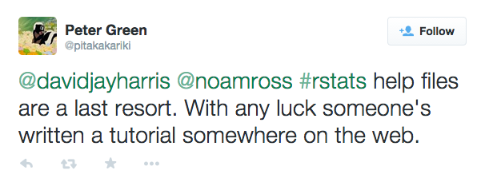
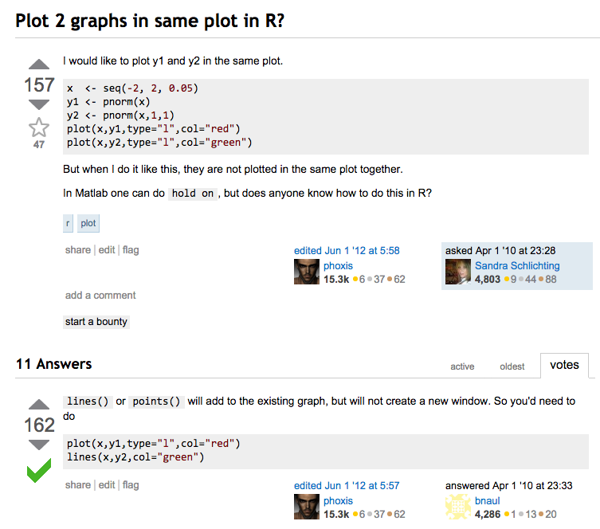
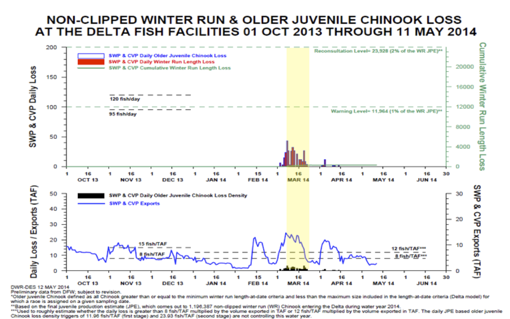
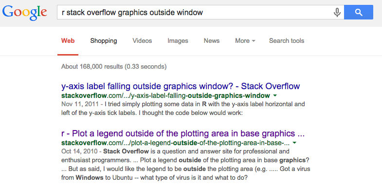
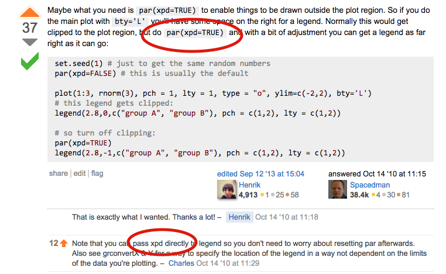
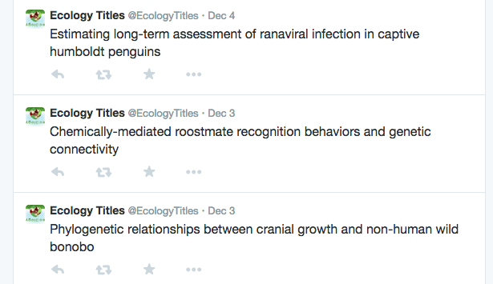
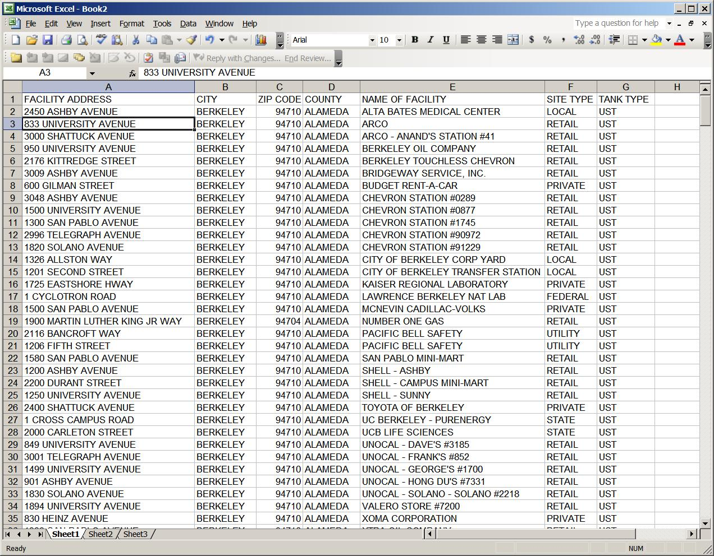

tutoR
========================================================
author: David J. Harris
date: December 6-7, 2014
transition: none


Workshop goals:
========================================================
incremental:true

* Learn enough to get started on your own
* Learn what tools are available for when you need them
* Don't try to absorb *everything*.

  Ask lots of questions!

Topics
========================================================

* **Saturday morning**
  * Introduction, examples
  * Talking to R
  * Getting help
  * Errors, warnings, & bugs
  * Data
* **Saturday afternoon**
  * Plotting
  * Importing data
  * Loops
  * Stats

***

* **Sunday**
  * text
  * functions
  * formatting excel data
  * reproducibility

Why code?
===================================
* Automation
* Reproducibility
* Customization

Example 1: data cleaning
==================================


```r
library(taxize)
tnrs(query = mynames, source = "iPlant_TNRS")[ , c(1:2)]
```

```
        submittedname        acceptedname
7   Helianthus annuus   Helianthus annuus
4       Pinus contort      Pinus contorta
5            Poa anua           Poa annua
3      Abis magnifica     Abies magnifica
8     Rosa california    Rosa californica
2  Festuca arundinace Festuca arundinacea
1 Sorbus occidentalos Sorbus occidentalis
6        Madia sateva        Madia sativa
```

Example 2: Data cleaning
===============================
incremental:true
    34.868688 N, 87.6041417 W 
    34.6386747 N, 87.1912919 W 
    34.8 N, 87.7333333 W 
    34.0297881 N, 87.0592352 W 
    34.2016687 N, 86.4934089 W 
    34.5012877 N, 86.6855493 W 
 

```r
# Throw out everything from the first space to the end
north = as.numeric(gsub(" .*$", "", latlon))

# Retain only the bit between ", " and " W"
west = -as.numeric(gsub(".*, (.*) W", "\\1", z))
```


Example 2: Mapping bird distributions
===============================
(see "[bbs.html](bbs.html)")

Questions?
==================
type:prompt

Why R?
========================
incremental:true

It's what your colleagues use
  * packages to do stuff you want
  * interfaces with everything else
  * share code with colleagues

RStudio
=====================================


Questions?
==================
type:prompt

Talking to R
======================================
incremental:true
type:section

R is like your old graphing calculator
=====================================
incremental:true
## Arithemetic works like you'd expect:

```r
(1 + 1 * 3)^3
```

```
[1] 64
```

## So do lots of basic math functions:

```r
cos(pi)
```

```
[1] -1
```

R is like your old graphing calculator
=====================================
incremental:true

R can also make graphs


```r
plot(function(x) sin(x^2), from = 0, to = 5)
```

 

Code can include "comments"
==================================
incremental:true

Anything following "`#`" is ignored through the end of the line.


```r
1+1 # This is a comment.  R ignores it.
```

```
[1] 2
```

```r
2+2 # But tomorrow, it could be helpful
```

```
[1] 4
```


```r
# for understanding the code you
# wrote today.
```

Questions?
==================
type:prompt

Assignment: Data can have names
=====================================
type:section


Referring back to our data
=================================
incremental:true

* Don't always want to type 525600 for number of minutes in a year.
* Want to separate data from code:
  * Insect biomass = fly biomass + beetle biomass + bug biomass
  * Total biomass = fly biomass + beetle biomass + bug biomass + algae biomass
* Only need to update _fly biomass_ once. 

Giving a name to your data
===================================
incremental:true
* `name <- data` &nbsp;&nbsp;&nbsp;&nbsp;&nbsp;&nbsp;&nbsp;&nbsp;&nbsp;&nbsp;&nbsp;&nbsp;or&nbsp;&nbsp;&nbsp;&nbsp;&nbsp;&nbsp;&nbsp;&nbsp;&nbsp;&nbsp;&nbsp;&nbsp; `name = data`
  * "The container called 'name' gets filled with the data"
  

```r
insect_biomass = 12
area = 50
proportion_ants = .3
```


```r
insect_biomass / area
```

```
[1] 0.24
```

```r
insect_biomass * proportion_ants
```

```
[1] 3.6
```

Questions?
==================
type:prompt

Changing saved values
=======================
incremental:true


```r
x = 2  # Save "2"" with the name "x"
y = x  # save x's current value with the name "y"
```


```r
x = 3  # Change x's value to 3
x
```

```
[1] 3
```

* What's y's value?

```r
y
```

```
[1] 2
```


Keeping track of what you've saved
=============================
incremental:true
* RStudio tells you what you've saved in the upper-right under "Environment→Global Environment"
* Sometimes also called the "workspace"
* Can also access it with the `ls()` or `objects` commands
* Clear everything out with the broom icon


Using functions
==============================
type:section


Using functions:
=============================
incremental:true

```r
(sin(1) + log(5)) / 3
```

```
[1] 0.817
```

Functions are verbs
========================
incremental:true
"Take this thing and do the function to it"

* Take this cookie and **eat** it
* Take this number and **square** it


```r
cos(pi) # Take pi and *calculate its cosine*
```

```
[1] -1
```


```r
log(area) # Take `area` & *calculate its log*
```

```
[1] 3.912
```

Functions can have modifiers
===============================
incremental:true

* Take this cookie and **eat** it **carefully**


```r
log(area, base = 2) # Take `area` & *calculate its log* *in base 2*
```

```
[1] 5.644
```


```r
rep(5, times = 7) # Take 5 and *repeat* it 7 times*
```

```
[1] 5 5 5 5 5 5 5
```

* Data & modifiers passed to functions are called *arguments*

Anatomy of a function call
===================================
* Name of function (`sin`, `log`, `rep`)
* Parentheses enclosing the arguments
* Arguments, separated by commas

Arguments
==================================

Naming the arguments is (usually) optional:

```r
log(3, 2)
```

```
[1] 1.585
```

```r
log(x = 3, base = 2)
```

```
[1] 1.585
```
***

Some arguments have default values that don't need to be specified: these can
be found on the help pages.

<center>**Questions so far?**</center>

There are tons of functions!
=================================
incremental:true
* You don't need to know all of them
* Most common R usage pattern: use pre-written functions on your custom data
  * do standard actions to your unique stuff
* You can also write your own functions

<Break>
===============================
type:section


Getting help
===============================
type:section

Help files
================================
incremental:true
* `?function_name` or `help(function_name)`

```r
help(rep)
?rep
```

* Some special functions like "+" need to be quoted; quoting never hurts

Parts of a help file
=============================
* **Title:** big picture in big text
* **Description:** summary
* **Usage:** very minimal examples
* **Arguments:** list of ways you can customize the function's action for your needs
* **Details:** Details
* **Value:** What you get out of the function
* **Examples** (consider starting here): ways to use the function

Some help files have a **Note** or **Warning** section for even more information

Help files are annoying
===========================
incremental:true



***

* Need to know the function name
* Operators and special things need backticks
* Written for programmers, by programmers
* Might need to look in 3-4 different sections.
  * Jump around, focus on **Usage** and **Examples**
* It gets easier

Other help sources (part 1)
==========================
* Task views (for sifting through packages on a given topic):
  * Ecology: http://cran.r-project.org/web/views/Environmetrics.html
  * Spatial: http://cran.r-project.org/web/views/Spatial.html
  * Phylogenetics: http://cran.r-project.org/web/views/Phylogenetics.html
  * Genetics: http://cran.r-project.org/web/views/Genetics.html
*  Vignettes (for package tutorials etc):
  * `vignette(topic = "topic_name", package = "package_name")`
  * vignette PDFs on CRAN

Other help sources (part 2)
================================

* Google, http://www.rseek.org/
  * Stack Overflow / Cross Validated (read and/or ask)
  * R-help lists (read-only!)
* Davis R Users Group (and mailing list: read and/or ask)
* [More tips](http://www.burns-stat.com/documents/tutorials/impatient-r/more-r-search/)

Other help sources (part 2)
===============================



Getting ahead of the curve
==============================
Books/courses
* [Impatient R](http://www.burns-stat.com/documents/tutorials/impatient-r/)
* [R Basics workshop:](http://rbasicsworkshop.weebly.com/presentations--exersices.html)
* Notes from [Cosma Shalizi's statistical computing course](http://www.stat.cmu.edu/~cshalizi/statcomp/14/)
* *[The Art of R programming](http://www.amazon.com/The-Art-Programming-Statistical-Software/dp/1593273843)*
* [Duncan Temple Lang](http://www.stat.ucdavis.edu/~duncan/)'s courses at Davis
* Hadley Wickham's [Advanced R](http://adv-r.had.co.nz/) website/book

***

R "Gotcha's" 
 * *[The R Inferno](http://www.burns-stat.com/documents/books/the-r-inferno/)*
 * [aRrgh: a newcomer's (angry) guide to R](http://tim-smith.us/arrgh/) (written for programmers)

Questions?
======================
type:section

When things go wrong
=====================
incremental:true

* Errors
  * "Something went so badly wrong that I stopped and gave up before I broke something"
  * `1 + "two"`

```
Error in 1 + "two" : non-numeric argument to binary operator
```

***

* Warnings
  * "Something *might* be wrong, but I kept going"
  * `log(-1)`

```
[1] NaN
Warning message:
In log(-1) : NaNs produced
```

When things go wrong
========================
* Bugs:
  * "I told R to do the wrong thing"
  * These are the scariest, because you don't always know your code is wrong.
* [More on errors and warnings](http://www.burns-stat.com/documents/tutorials/impatient-r/#errors)

***


A horrifying bug
=================

```r
pi = 7
#
# 100 lines of code later...
#
cos(pi)
```

```
[1] 0.7539
```


Questions?
======================
type:section

Break
==============
type:section

Data (nouns)
===============
type:section


Vectors
==============
incremental:true
We've already seen *scalars*


```r
area = 50
```


* Data can also form *vectors*

```r
rep(1, times = 5)
```

```
[1] 1 1 1 1 1
```

Making your own vectors
======================
incremental:true

Use the `c` ("combine") function
* Elements have a position and (optionally) names


```r
biomass = c(bugs = 12.1, flies = 23.7, beetles = 3.1)
biomass2 = c(bugs = 7.1, flies = 3.8, beetles = 8.2)
```

* Concatenate vectors with `c` as well.

```r
both_biomass = c(biomass, biomass2)
```

Vectors can hold different kinds of data
===================
* Vectors always belong to *one* "type"
  * **logical**: TRUE or FALSE
  * **integer**: ..., -1, 0, 1, 2, ...
  * **numeric**: 3.141592653589793115998, 2.718281828459045090796
  * **character**: "anything", "3", "ΣΔΘ™"
* R "promotes" vectors when concatenated:
  * `c(biomass, "not a number")` is a character vector

<center>**Questions?**</center>

Arithmetic on vectors:
=================================

Arithmetic works element-by-element (based on position, *not* name!)


```r
biomass
```

```
   bugs   flies beetles 
   12.1    23.7     3.1 
```

```r
biomass2
```

```
   bugs   flies beetles 
    7.1     3.8     8.2 
```

```r
biomass + biomass2
```

```
   bugs   flies beetles 
   19.2    27.5    11.3 
```

Shorter vectors are "recycled"
==================================

```r
biomass
```

```
   bugs   flies beetles 
   12.1    23.7     3.1 
```

```r
area
```

```
[1] 50
```

```r
biomass / area
```

```
   bugs   flies beetles 
  0.242   0.474   0.062 
```

Recycling can be dangerous!
====================================

```r
c(10, 20) + c(1, 2, 3, 4)
```

```
[1] 11 22 13 24
```


You can also compare vectors
===========================
incremental:true

Greater-than-or-equal (≥, typed as `>=`)

```r
biomass >= biomass2
```

```
   bugs   flies beetles 
   TRUE    TRUE   FALSE 
```

Test for equality with `==`


```r
5 == 5 * 1
```

```
[1] TRUE
```

***

* Be careful about rounding error!

```r
(1.0 - 0.9 - 0.1) == 0
```

```
[1] FALSE
```

* $1.0 - 0.9 - 0.1 = -2.78^{-17}$

* use `all.equal` instead

Getting data out of a vector with [square brackets]
==============================
We want the second element of our vector, which has fly biomass


```
   bugs   flies beetles 
   12.1    23.7     3.1 
```


```r
biomass["flies"]               # By name
biomass[2]                     # By index
biomass[c(-1, -3)]             # Drop negatives
biomass[c(FALSE, TRUE, FALSE)] # With logic
biomass[biomass > 20]          # With a test
```

Factors
=======================
* Describes **categories** like experimental treatments
  * "Nitrogen addition", "Phosphorous addition",  "Control"


```r
factor(c("Nitrogen addition", "Phosphorous addition",  "Control", "Nitrogen addition"))
```

<center>**Stored internally as 1, 2, 3!**</center>

Questions about vectors?
=========================

Data frames
=======================
incremental:true

Remember `biomass` and `biomass2`?

* What if you have biomasses at 100 sites?


```r
biomass_df = data.frame(
  site = c("site 1", "site 2", "site 3", "site 4", "site 5"), 
  bugs = c(12.1, 7.1, 2.8, 12.5, 3.1), 
  flies = c(23.7, 3.8, 11.3, 32.1, 11.9),
  beetles = c(3.1, 8.2, 17.1, 3.9, 11.7)
)
```

Data frames
==============================

```r
biomass_df = data.frame(
  site = c("site 1", "site 2", "site 3", "site 4", "site 5"), 
  bugs = c(12.1, 7.1, 2.8, 12.5, 3.1), 
  flies = c(23.7, 3.8, 11.3, 32.1, 11.9),
  beetles = c(3.1, 8.2, 17.1, 3.9, 11.7)
)
```

A `data.frame` has one column for each variable, and one row for each replicate.

Each variable is a vector.

Variables can be different types

Can contain missing values (`NA`)

Learning about your objects
==============================


```r
# Structure of object
str(biomass_df) # Rstudio has same info
```

```
'data.frame':	5 obs. of  4 variables:
 $ site   : Factor w/ 5 levels "site 1","site 2",..: 1 2 3 4 5
 $ bugs   : num  12.1 7.1 2.8 12.5 3.1
 $ flies  : num  23.7 3.8 11.3 32.1 11.9
 $ beetles: num  3.1 8.2 17.1 3.9 11.7
```


```r
# Top 6 rows.with "head"
head(InsectSprays) # "Tail" gives bottom 6
```

```
  count spray
1    10     A
2     7     A
3    20     A
4    14     A
5    14     A
6    12     A
```

Learning about your objects
============================

```r
class(biomass_df)  # What is it?
```

```
[1] "data.frame"
```

```r
length(biomass_df) # Number of vectors in DF
```

```
[1] 4
```

```r
dim(biomass_df)    # Dimensions
```

```
[1] 5 4
```

***

```r
plot(biomass_df)   # What's it look like?
```

 


Subsetting data frames
=========================

```r
biomass_df$flies # pull out fly vector
```

```
[1] 23.7  3.8 11.3 32.1 11.9
```

```r
# rows 1 and 2, columns "flies" and "beetles"
biomass_df[c(1, 2), c("flies", "beetles")]
```

```
  flies beetles
1  23.7     3.1
2   3.8     8.2
```

Subsetting data frames
====================
incremental:true
* `[` versus `[[` versus `$`
  * `$` works on lists (including data frames). Pulls out _one_ element (e.g. a vector)
  * `[[` works on anything: pulls out _one_ element (e.g. a vector)
  * `[` works on anything: pulls out _one or more_ elements, leaving them in their original container (e.g. a dataframe).
  
Questions?
=================
type:prompt

Lunch!
==================
type:section

Plotting
==================
Workhorse is the `plot` function


```r
plot(biomass_df)
```

 

Plotting
==================
Workhorse is the `plot` function


```r
# The tilde indicates a "formula"
# "data" tells R where to look for flies/bugs
plot(flies ~ bugs , data = biomass_df)
```

 

Plotting
==================
Workhorse is the `plot` function


```r
plot(function(x) sin(x^2), from = 0, to = 5)
```

 

Plotting
=======================
Lots of other functions too!

```r
hist(biomass_df$beetles)
```

 

A blank canvas
========================

```r
plot(NULL, xlim = range(biomass_df$bugs), ylim = range(biomass_df$flies), xlab = "bug biomass (g/m^2)", ylab = "fly biomass (g/m^2)")
```

 

Adding points to the canvas
========================

```r
points(bugs ~ flies , data = biomass_df)
```

 

Spicing it up
=====================

```r
arrows(x0 = 5, y0=8, x1 = 12, y1 = 20, lwd = 5, col = "blue")
text(x = 5, y = 20, labels = "Text", cex = 3)
```


 

Questions?
=======================
type:prompt

Customization alphabet soup
=====================
## `?par`

* **main:** main plot title
* **sub:** plot subtitle
* **xlab/ylab:** axis labels, 
* **log:** which axes should be on log scale
* **type:** **l**ine, **p**oint, **b**oth, etc.
* **cex:** **c**haracter **ex**pansion (size factor)
* **mfrow/mfcol:** Number of rows & columns on canvas

****

* **pch:** **p**lotting **ch**aracter
* **col:** color
* **lty:** **l**ine **ty**pe (dashed, dotted, etc)
* **lwd:** **l**ine **w**i**d**th
* **bty:** **b**ox  **ty**pe
* **mgp:** margin size
* **axes:** TRUE/FALSE
* **asp:** Aspect ratio

A real example
==================
incremental:true



A real example
=================

```r
par(mfrow = c(2, 1)) # 2 rows of plots

myyellow = rgb(red = 1, green = 1, blue = 0, alpha = .4)

# Plot the first beaver's temp versus time
plot(temp ~ time, data = beaver1, main = "Beaver 1")

# Giant rectangle
rect(xleft = 800, xright = 1500, ytop = 1000, ybottom = -1000, col = myyellow, border = NA)

# Plot 2nd beaver's temperature versus time
plot(temp ~ time, data = beaver2, main = "Beaver 2")
rect(xleft = 800, xright = 1500, ytop = 1000, ybottom = -1000, col = myyellow, border = NA)
```

A real example
=================

 

A real example
=================




A real example
=================



A real example
===================
 

Saving your plots
===========================
* Rstudio "Export" button
* Other *graphics devices* (png, pdf, jpeg, tiff, etc.)


```r
# Set up the plotting device
pdf("figures/myplot.pdf", length = 7, width = 5)

# As many lines of graphics code as you'd like
plot(count ~ spray, data = InsectSprays)

# Seal up the pdf
dev.off()
```


Maps
===================

```r
library(mapdata)
# Tweak the margins
par("mai" = c(0, 0, 0, 0))
map(
  database = "worldHires", 
  proj = "albers", 
  param = c(29.5, 45.5),
  interior = TRUE,
  ylim = c(25, 75),
  xlim = c(-167, -53),
  resolution = 0.1,
  wrap = TRUE,
  col = "gray",
  mar = c(0, 0, 0, 0),
  myborder = 0,
  orientation = c(95, -102, 0),
  lwd = 2
)
```

Maps
===================
 


Other graphics systems: ggplot2
==========================


```r
 qplot(x = displ, y = hwy, data = mpg, color = drv) + facet_wrap(~ cyl)
```

 

Other graphics systems: Lattice
==========================


```r
xyplot(hwy ~ displ | cyl, data = mpg, groups = drv)
```

 

Importing data
====================
type:section


Spreadsheets
==================
* `read.csv(file = "filename.csv")`
  * `stringsAsFactors=FALSE`
  * `header`?
  * `data.table::fread` is often faster


```r
head(read.csv("routes.csv")[3:6], header = TRUE, stringsAsFactors = FALSE)
```

```
  Route Active  Lati  Longi
1     1      1 34.87 -87.60
2     2      0 34.64 -87.19
3     3      0 34.80 -87.73
4     4      1 34.03 -87.06
5     5      0 34.20 -86.49
6     6      1 34.50 -86.69
```

Excel and databases
========================
* `RODBC` package
* `RMySQL`, `RSQLite`, `RPostgreSQL`, etc.
* http://cran.r-project.org/doc/manuals/r-release/R-data.html

* `dplyr`

Spatial data
=================
* [Methods for importing shapefiles](https://www.nceas.ucsb.edu/scicomp/usecases/ReadWriteESRIShapeFiles)
* The `raster` package is very efficient with large raster 
* The `sp` package has a lot of low-level spatial machinery (e.g. projections)
* `maps`, `mapdata`, and `maptools` for drawing maps in base graphics
* `RgoogleMaps` talks to Google Maps
* `ggmap` does maps in `ggplot2`
* [Spatial task view](http://cran.r-project.org/web/views/Spatial.html)

Talking to the Internet
==================
* `download.file`
* `RCurl` and `httr` packages for requesting data
* `XML` package for parsing web pages
* [Web Technologies Task View](http://cran.r-project.org/web/views/WebTechnologies.html)

***
* `twitteR` package



Loops and automation
=================
type:section

Computers are good at repetition
==================================
incremental:true

```r
rep("computers are good at repetition", 1000)
```

```
   [1] "computers are good at repetition"
   [2] "computers are good at repetition"
   [3] "computers are good at repetition"
   [4] "computers are good at repetition"
   [5] "computers are good at repetition"
   [6] "computers are good at repetition"
   [7] "computers are good at repetition"
   [8] "computers are good at repetition"
   [9] "computers are good at repetition"
  [10] "computers are good at repetition"
  [11] "computers are good at repetition"
  [12] "computers are good at repetition"
  [13] "computers are good at repetition"
  [14] "computers are good at repetition"
  [15] "computers are good at repetition"
  [16] "computers are good at repetition"
  [17] "computers are good at repetition"
  [18] "computers are good at repetition"
  [19] "computers are good at repetition"
  [20] "computers are good at repetition"
  [21] "computers are good at repetition"
  [22] "computers are good at repetition"
  [23] "computers are good at repetition"
  [24] "computers are good at repetition"
  [25] "computers are good at repetition"
  [26] "computers are good at repetition"
  [27] "computers are good at repetition"
  [28] "computers are good at repetition"
  [29] "computers are good at repetition"
  [30] "computers are good at repetition"
  [31] "computers are good at repetition"
  [32] "computers are good at repetition"
  [33] "computers are good at repetition"
  [34] "computers are good at repetition"
  [35] "computers are good at repetition"
  [36] "computers are good at repetition"
  [37] "computers are good at repetition"
  [38] "computers are good at repetition"
  [39] "computers are good at repetition"
  [40] "computers are good at repetition"
  [41] "computers are good at repetition"
  [42] "computers are good at repetition"
  [43] "computers are good at repetition"
  [44] "computers are good at repetition"
  [45] "computers are good at repetition"
  [46] "computers are good at repetition"
  [47] "computers are good at repetition"
  [48] "computers are good at repetition"
  [49] "computers are good at repetition"
  [50] "computers are good at repetition"
  [51] "computers are good at repetition"
  [52] "computers are good at repetition"
  [53] "computers are good at repetition"
  [54] "computers are good at repetition"
  [55] "computers are good at repetition"
  [56] "computers are good at repetition"
  [57] "computers are good at repetition"
  [58] "computers are good at repetition"
  [59] "computers are good at repetition"
  [60] "computers are good at repetition"
  [61] "computers are good at repetition"
  [62] "computers are good at repetition"
  [63] "computers are good at repetition"
  [64] "computers are good at repetition"
  [65] "computers are good at repetition"
  [66] "computers are good at repetition"
  [67] "computers are good at repetition"
  [68] "computers are good at repetition"
  [69] "computers are good at repetition"
  [70] "computers are good at repetition"
  [71] "computers are good at repetition"
  [72] "computers are good at repetition"
  [73] "computers are good at repetition"
  [74] "computers are good at repetition"
  [75] "computers are good at repetition"
  [76] "computers are good at repetition"
  [77] "computers are good at repetition"
  [78] "computers are good at repetition"
  [79] "computers are good at repetition"
  [80] "computers are good at repetition"
  [81] "computers are good at repetition"
  [82] "computers are good at repetition"
  [83] "computers are good at repetition"
  [84] "computers are good at repetition"
  [85] "computers are good at repetition"
  [86] "computers are good at repetition"
  [87] "computers are good at repetition"
  [88] "computers are good at repetition"
  [89] "computers are good at repetition"
  [90] "computers are good at repetition"
  [91] "computers are good at repetition"
  [92] "computers are good at repetition"
  [93] "computers are good at repetition"
  [94] "computers are good at repetition"
  [95] "computers are good at repetition"
  [96] "computers are good at repetition"
  [97] "computers are good at repetition"
  [98] "computers are good at repetition"
  [99] "computers are good at repetition"
 [100] "computers are good at repetition"
 [101] "computers are good at repetition"
 [102] "computers are good at repetition"
 [103] "computers are good at repetition"
 [104] "computers are good at repetition"
 [105] "computers are good at repetition"
 [106] "computers are good at repetition"
 [107] "computers are good at repetition"
 [108] "computers are good at repetition"
 [109] "computers are good at repetition"
 [110] "computers are good at repetition"
 [111] "computers are good at repetition"
 [112] "computers are good at repetition"
 [113] "computers are good at repetition"
 [114] "computers are good at repetition"
 [115] "computers are good at repetition"
 [116] "computers are good at repetition"
 [117] "computers are good at repetition"
 [118] "computers are good at repetition"
 [119] "computers are good at repetition"
 [120] "computers are good at repetition"
 [121] "computers are good at repetition"
 [122] "computers are good at repetition"
 [123] "computers are good at repetition"
 [124] "computers are good at repetition"
 [125] "computers are good at repetition"
 [126] "computers are good at repetition"
 [127] "computers are good at repetition"
 [128] "computers are good at repetition"
 [129] "computers are good at repetition"
 [130] "computers are good at repetition"
 [131] "computers are good at repetition"
 [132] "computers are good at repetition"
 [133] "computers are good at repetition"
 [134] "computers are good at repetition"
 [135] "computers are good at repetition"
 [136] "computers are good at repetition"
 [137] "computers are good at repetition"
 [138] "computers are good at repetition"
 [139] "computers are good at repetition"
 [140] "computers are good at repetition"
 [141] "computers are good at repetition"
 [142] "computers are good at repetition"
 [143] "computers are good at repetition"
 [144] "computers are good at repetition"
 [145] "computers are good at repetition"
 [146] "computers are good at repetition"
 [147] "computers are good at repetition"
 [148] "computers are good at repetition"
 [149] "computers are good at repetition"
 [150] "computers are good at repetition"
 [151] "computers are good at repetition"
 [152] "computers are good at repetition"
 [153] "computers are good at repetition"
 [154] "computers are good at repetition"
 [155] "computers are good at repetition"
 [156] "computers are good at repetition"
 [157] "computers are good at repetition"
 [158] "computers are good at repetition"
 [159] "computers are good at repetition"
 [160] "computers are good at repetition"
 [161] "computers are good at repetition"
 [162] "computers are good at repetition"
 [163] "computers are good at repetition"
 [164] "computers are good at repetition"
 [165] "computers are good at repetition"
 [166] "computers are good at repetition"
 [167] "computers are good at repetition"
 [168] "computers are good at repetition"
 [169] "computers are good at repetition"
 [170] "computers are good at repetition"
 [171] "computers are good at repetition"
 [172] "computers are good at repetition"
 [173] "computers are good at repetition"
 [174] "computers are good at repetition"
 [175] "computers are good at repetition"
 [176] "computers are good at repetition"
 [177] "computers are good at repetition"
 [178] "computers are good at repetition"
 [179] "computers are good at repetition"
 [180] "computers are good at repetition"
 [181] "computers are good at repetition"
 [182] "computers are good at repetition"
 [183] "computers are good at repetition"
 [184] "computers are good at repetition"
 [185] "computers are good at repetition"
 [186] "computers are good at repetition"
 [187] "computers are good at repetition"
 [188] "computers are good at repetition"
 [189] "computers are good at repetition"
 [190] "computers are good at repetition"
 [191] "computers are good at repetition"
 [192] "computers are good at repetition"
 [193] "computers are good at repetition"
 [194] "computers are good at repetition"
 [195] "computers are good at repetition"
 [196] "computers are good at repetition"
 [197] "computers are good at repetition"
 [198] "computers are good at repetition"
 [199] "computers are good at repetition"
 [200] "computers are good at repetition"
 [201] "computers are good at repetition"
 [202] "computers are good at repetition"
 [203] "computers are good at repetition"
 [204] "computers are good at repetition"
 [205] "computers are good at repetition"
 [206] "computers are good at repetition"
 [207] "computers are good at repetition"
 [208] "computers are good at repetition"
 [209] "computers are good at repetition"
 [210] "computers are good at repetition"
 [211] "computers are good at repetition"
 [212] "computers are good at repetition"
 [213] "computers are good at repetition"
 [214] "computers are good at repetition"
 [215] "computers are good at repetition"
 [216] "computers are good at repetition"
 [217] "computers are good at repetition"
 [218] "computers are good at repetition"
 [219] "computers are good at repetition"
 [220] "computers are good at repetition"
 [221] "computers are good at repetition"
 [222] "computers are good at repetition"
 [223] "computers are good at repetition"
 [224] "computers are good at repetition"
 [225] "computers are good at repetition"
 [226] "computers are good at repetition"
 [227] "computers are good at repetition"
 [228] "computers are good at repetition"
 [229] "computers are good at repetition"
 [230] "computers are good at repetition"
 [231] "computers are good at repetition"
 [232] "computers are good at repetition"
 [233] "computers are good at repetition"
 [234] "computers are good at repetition"
 [235] "computers are good at repetition"
 [236] "computers are good at repetition"
 [237] "computers are good at repetition"
 [238] "computers are good at repetition"
 [239] "computers are good at repetition"
 [240] "computers are good at repetition"
 [241] "computers are good at repetition"
 [242] "computers are good at repetition"
 [243] "computers are good at repetition"
 [244] "computers are good at repetition"
 [245] "computers are good at repetition"
 [246] "computers are good at repetition"
 [247] "computers are good at repetition"
 [248] "computers are good at repetition"
 [249] "computers are good at repetition"
 [250] "computers are good at repetition"
 [251] "computers are good at repetition"
 [252] "computers are good at repetition"
 [253] "computers are good at repetition"
 [254] "computers are good at repetition"
 [255] "computers are good at repetition"
 [256] "computers are good at repetition"
 [257] "computers are good at repetition"
 [258] "computers are good at repetition"
 [259] "computers are good at repetition"
 [260] "computers are good at repetition"
 [261] "computers are good at repetition"
 [262] "computers are good at repetition"
 [263] "computers are good at repetition"
 [264] "computers are good at repetition"
 [265] "computers are good at repetition"
 [266] "computers are good at repetition"
 [267] "computers are good at repetition"
 [268] "computers are good at repetition"
 [269] "computers are good at repetition"
 [270] "computers are good at repetition"
 [271] "computers are good at repetition"
 [272] "computers are good at repetition"
 [273] "computers are good at repetition"
 [274] "computers are good at repetition"
 [275] "computers are good at repetition"
 [276] "computers are good at repetition"
 [277] "computers are good at repetition"
 [278] "computers are good at repetition"
 [279] "computers are good at repetition"
 [280] "computers are good at repetition"
 [281] "computers are good at repetition"
 [282] "computers are good at repetition"
 [283] "computers are good at repetition"
 [284] "computers are good at repetition"
 [285] "computers are good at repetition"
 [286] "computers are good at repetition"
 [287] "computers are good at repetition"
 [288] "computers are good at repetition"
 [289] "computers are good at repetition"
 [290] "computers are good at repetition"
 [291] "computers are good at repetition"
 [292] "computers are good at repetition"
 [293] "computers are good at repetition"
 [294] "computers are good at repetition"
 [295] "computers are good at repetition"
 [296] "computers are good at repetition"
 [297] "computers are good at repetition"
 [298] "computers are good at repetition"
 [299] "computers are good at repetition"
 [300] "computers are good at repetition"
 [301] "computers are good at repetition"
 [302] "computers are good at repetition"
 [303] "computers are good at repetition"
 [304] "computers are good at repetition"
 [305] "computers are good at repetition"
 [306] "computers are good at repetition"
 [307] "computers are good at repetition"
 [308] "computers are good at repetition"
 [309] "computers are good at repetition"
 [310] "computers are good at repetition"
 [311] "computers are good at repetition"
 [312] "computers are good at repetition"
 [313] "computers are good at repetition"
 [314] "computers are good at repetition"
 [315] "computers are good at repetition"
 [316] "computers are good at repetition"
 [317] "computers are good at repetition"
 [318] "computers are good at repetition"
 [319] "computers are good at repetition"
 [320] "computers are good at repetition"
 [321] "computers are good at repetition"
 [322] "computers are good at repetition"
 [323] "computers are good at repetition"
 [324] "computers are good at repetition"
 [325] "computers are good at repetition"
 [326] "computers are good at repetition"
 [327] "computers are good at repetition"
 [328] "computers are good at repetition"
 [329] "computers are good at repetition"
 [330] "computers are good at repetition"
 [331] "computers are good at repetition"
 [332] "computers are good at repetition"
 [333] "computers are good at repetition"
 [334] "computers are good at repetition"
 [335] "computers are good at repetition"
 [336] "computers are good at repetition"
 [337] "computers are good at repetition"
 [338] "computers are good at repetition"
 [339] "computers are good at repetition"
 [340] "computers are good at repetition"
 [341] "computers are good at repetition"
 [342] "computers are good at repetition"
 [343] "computers are good at repetition"
 [344] "computers are good at repetition"
 [345] "computers are good at repetition"
 [346] "computers are good at repetition"
 [347] "computers are good at repetition"
 [348] "computers are good at repetition"
 [349] "computers are good at repetition"
 [350] "computers are good at repetition"
 [351] "computers are good at repetition"
 [352] "computers are good at repetition"
 [353] "computers are good at repetition"
 [354] "computers are good at repetition"
 [355] "computers are good at repetition"
 [356] "computers are good at repetition"
 [357] "computers are good at repetition"
 [358] "computers are good at repetition"
 [359] "computers are good at repetition"
 [360] "computers are good at repetition"
 [361] "computers are good at repetition"
 [362] "computers are good at repetition"
 [363] "computers are good at repetition"
 [364] "computers are good at repetition"
 [365] "computers are good at repetition"
 [366] "computers are good at repetition"
 [367] "computers are good at repetition"
 [368] "computers are good at repetition"
 [369] "computers are good at repetition"
 [370] "computers are good at repetition"
 [371] "computers are good at repetition"
 [372] "computers are good at repetition"
 [373] "computers are good at repetition"
 [374] "computers are good at repetition"
 [375] "computers are good at repetition"
 [376] "computers are good at repetition"
 [377] "computers are good at repetition"
 [378] "computers are good at repetition"
 [379] "computers are good at repetition"
 [380] "computers are good at repetition"
 [381] "computers are good at repetition"
 [382] "computers are good at repetition"
 [383] "computers are good at repetition"
 [384] "computers are good at repetition"
 [385] "computers are good at repetition"
 [386] "computers are good at repetition"
 [387] "computers are good at repetition"
 [388] "computers are good at repetition"
 [389] "computers are good at repetition"
 [390] "computers are good at repetition"
 [391] "computers are good at repetition"
 [392] "computers are good at repetition"
 [393] "computers are good at repetition"
 [394] "computers are good at repetition"
 [395] "computers are good at repetition"
 [396] "computers are good at repetition"
 [397] "computers are good at repetition"
 [398] "computers are good at repetition"
 [399] "computers are good at repetition"
 [400] "computers are good at repetition"
 [401] "computers are good at repetition"
 [402] "computers are good at repetition"
 [403] "computers are good at repetition"
 [404] "computers are good at repetition"
 [405] "computers are good at repetition"
 [406] "computers are good at repetition"
 [407] "computers are good at repetition"
 [408] "computers are good at repetition"
 [409] "computers are good at repetition"
 [410] "computers are good at repetition"
 [411] "computers are good at repetition"
 [412] "computers are good at repetition"
 [413] "computers are good at repetition"
 [414] "computers are good at repetition"
 [415] "computers are good at repetition"
 [416] "computers are good at repetition"
 [417] "computers are good at repetition"
 [418] "computers are good at repetition"
 [419] "computers are good at repetition"
 [420] "computers are good at repetition"
 [421] "computers are good at repetition"
 [422] "computers are good at repetition"
 [423] "computers are good at repetition"
 [424] "computers are good at repetition"
 [425] "computers are good at repetition"
 [426] "computers are good at repetition"
 [427] "computers are good at repetition"
 [428] "computers are good at repetition"
 [429] "computers are good at repetition"
 [430] "computers are good at repetition"
 [431] "computers are good at repetition"
 [432] "computers are good at repetition"
 [433] "computers are good at repetition"
 [434] "computers are good at repetition"
 [435] "computers are good at repetition"
 [436] "computers are good at repetition"
 [437] "computers are good at repetition"
 [438] "computers are good at repetition"
 [439] "computers are good at repetition"
 [440] "computers are good at repetition"
 [441] "computers are good at repetition"
 [442] "computers are good at repetition"
 [443] "computers are good at repetition"
 [444] "computers are good at repetition"
 [445] "computers are good at repetition"
 [446] "computers are good at repetition"
 [447] "computers are good at repetition"
 [448] "computers are good at repetition"
 [449] "computers are good at repetition"
 [450] "computers are good at repetition"
 [451] "computers are good at repetition"
 [452] "computers are good at repetition"
 [453] "computers are good at repetition"
 [454] "computers are good at repetition"
 [455] "computers are good at repetition"
 [456] "computers are good at repetition"
 [457] "computers are good at repetition"
 [458] "computers are good at repetition"
 [459] "computers are good at repetition"
 [460] "computers are good at repetition"
 [461] "computers are good at repetition"
 [462] "computers are good at repetition"
 [463] "computers are good at repetition"
 [464] "computers are good at repetition"
 [465] "computers are good at repetition"
 [466] "computers are good at repetition"
 [467] "computers are good at repetition"
 [468] "computers are good at repetition"
 [469] "computers are good at repetition"
 [470] "computers are good at repetition"
 [471] "computers are good at repetition"
 [472] "computers are good at repetition"
 [473] "computers are good at repetition"
 [474] "computers are good at repetition"
 [475] "computers are good at repetition"
 [476] "computers are good at repetition"
 [477] "computers are good at repetition"
 [478] "computers are good at repetition"
 [479] "computers are good at repetition"
 [480] "computers are good at repetition"
 [481] "computers are good at repetition"
 [482] "computers are good at repetition"
 [483] "computers are good at repetition"
 [484] "computers are good at repetition"
 [485] "computers are good at repetition"
 [486] "computers are good at repetition"
 [487] "computers are good at repetition"
 [488] "computers are good at repetition"
 [489] "computers are good at repetition"
 [490] "computers are good at repetition"
 [491] "computers are good at repetition"
 [492] "computers are good at repetition"
 [493] "computers are good at repetition"
 [494] "computers are good at repetition"
 [495] "computers are good at repetition"
 [496] "computers are good at repetition"
 [497] "computers are good at repetition"
 [498] "computers are good at repetition"
 [499] "computers are good at repetition"
 [500] "computers are good at repetition"
 [501] "computers are good at repetition"
 [502] "computers are good at repetition"
 [503] "computers are good at repetition"
 [504] "computers are good at repetition"
 [505] "computers are good at repetition"
 [506] "computers are good at repetition"
 [507] "computers are good at repetition"
 [508] "computers are good at repetition"
 [509] "computers are good at repetition"
 [510] "computers are good at repetition"
 [511] "computers are good at repetition"
 [512] "computers are good at repetition"
 [513] "computers are good at repetition"
 [514] "computers are good at repetition"
 [515] "computers are good at repetition"
 [516] "computers are good at repetition"
 [517] "computers are good at repetition"
 [518] "computers are good at repetition"
 [519] "computers are good at repetition"
 [520] "computers are good at repetition"
 [521] "computers are good at repetition"
 [522] "computers are good at repetition"
 [523] "computers are good at repetition"
 [524] "computers are good at repetition"
 [525] "computers are good at repetition"
 [526] "computers are good at repetition"
 [527] "computers are good at repetition"
 [528] "computers are good at repetition"
 [529] "computers are good at repetition"
 [530] "computers are good at repetition"
 [531] "computers are good at repetition"
 [532] "computers are good at repetition"
 [533] "computers are good at repetition"
 [534] "computers are good at repetition"
 [535] "computers are good at repetition"
 [536] "computers are good at repetition"
 [537] "computers are good at repetition"
 [538] "computers are good at repetition"
 [539] "computers are good at repetition"
 [540] "computers are good at repetition"
 [541] "computers are good at repetition"
 [542] "computers are good at repetition"
 [543] "computers are good at repetition"
 [544] "computers are good at repetition"
 [545] "computers are good at repetition"
 [546] "computers are good at repetition"
 [547] "computers are good at repetition"
 [548] "computers are good at repetition"
 [549] "computers are good at repetition"
 [550] "computers are good at repetition"
 [551] "computers are good at repetition"
 [552] "computers are good at repetition"
 [553] "computers are good at repetition"
 [554] "computers are good at repetition"
 [555] "computers are good at repetition"
 [556] "computers are good at repetition"
 [557] "computers are good at repetition"
 [558] "computers are good at repetition"
 [559] "computers are good at repetition"
 [560] "computers are good at repetition"
 [561] "computers are good at repetition"
 [562] "computers are good at repetition"
 [563] "computers are good at repetition"
 [564] "computers are good at repetition"
 [565] "computers are good at repetition"
 [566] "computers are good at repetition"
 [567] "computers are good at repetition"
 [568] "computers are good at repetition"
 [569] "computers are good at repetition"
 [570] "computers are good at repetition"
 [571] "computers are good at repetition"
 [572] "computers are good at repetition"
 [573] "computers are good at repetition"
 [574] "computers are good at repetition"
 [575] "computers are good at repetition"
 [576] "computers are good at repetition"
 [577] "computers are good at repetition"
 [578] "computers are good at repetition"
 [579] "computers are good at repetition"
 [580] "computers are good at repetition"
 [581] "computers are good at repetition"
 [582] "computers are good at repetition"
 [583] "computers are good at repetition"
 [584] "computers are good at repetition"
 [585] "computers are good at repetition"
 [586] "computers are good at repetition"
 [587] "computers are good at repetition"
 [588] "computers are good at repetition"
 [589] "computers are good at repetition"
 [590] "computers are good at repetition"
 [591] "computers are good at repetition"
 [592] "computers are good at repetition"
 [593] "computers are good at repetition"
 [594] "computers are good at repetition"
 [595] "computers are good at repetition"
 [596] "computers are good at repetition"
 [597] "computers are good at repetition"
 [598] "computers are good at repetition"
 [599] "computers are good at repetition"
 [600] "computers are good at repetition"
 [601] "computers are good at repetition"
 [602] "computers are good at repetition"
 [603] "computers are good at repetition"
 [604] "computers are good at repetition"
 [605] "computers are good at repetition"
 [606] "computers are good at repetition"
 [607] "computers are good at repetition"
 [608] "computers are good at repetition"
 [609] "computers are good at repetition"
 [610] "computers are good at repetition"
 [611] "computers are good at repetition"
 [612] "computers are good at repetition"
 [613] "computers are good at repetition"
 [614] "computers are good at repetition"
 [615] "computers are good at repetition"
 [616] "computers are good at repetition"
 [617] "computers are good at repetition"
 [618] "computers are good at repetition"
 [619] "computers are good at repetition"
 [620] "computers are good at repetition"
 [621] "computers are good at repetition"
 [622] "computers are good at repetition"
 [623] "computers are good at repetition"
 [624] "computers are good at repetition"
 [625] "computers are good at repetition"
 [626] "computers are good at repetition"
 [627] "computers are good at repetition"
 [628] "computers are good at repetition"
 [629] "computers are good at repetition"
 [630] "computers are good at repetition"
 [631] "computers are good at repetition"
 [632] "computers are good at repetition"
 [633] "computers are good at repetition"
 [634] "computers are good at repetition"
 [635] "computers are good at repetition"
 [636] "computers are good at repetition"
 [637] "computers are good at repetition"
 [638] "computers are good at repetition"
 [639] "computers are good at repetition"
 [640] "computers are good at repetition"
 [641] "computers are good at repetition"
 [642] "computers are good at repetition"
 [643] "computers are good at repetition"
 [644] "computers are good at repetition"
 [645] "computers are good at repetition"
 [646] "computers are good at repetition"
 [647] "computers are good at repetition"
 [648] "computers are good at repetition"
 [649] "computers are good at repetition"
 [650] "computers are good at repetition"
 [651] "computers are good at repetition"
 [652] "computers are good at repetition"
 [653] "computers are good at repetition"
 [654] "computers are good at repetition"
 [655] "computers are good at repetition"
 [656] "computers are good at repetition"
 [657] "computers are good at repetition"
 [658] "computers are good at repetition"
 [659] "computers are good at repetition"
 [660] "computers are good at repetition"
 [661] "computers are good at repetition"
 [662] "computers are good at repetition"
 [663] "computers are good at repetition"
 [664] "computers are good at repetition"
 [665] "computers are good at repetition"
 [666] "computers are good at repetition"
 [667] "computers are good at repetition"
 [668] "computers are good at repetition"
 [669] "computers are good at repetition"
 [670] "computers are good at repetition"
 [671] "computers are good at repetition"
 [672] "computers are good at repetition"
 [673] "computers are good at repetition"
 [674] "computers are good at repetition"
 [675] "computers are good at repetition"
 [676] "computers are good at repetition"
 [677] "computers are good at repetition"
 [678] "computers are good at repetition"
 [679] "computers are good at repetition"
 [680] "computers are good at repetition"
 [681] "computers are good at repetition"
 [682] "computers are good at repetition"
 [683] "computers are good at repetition"
 [684] "computers are good at repetition"
 [685] "computers are good at repetition"
 [686] "computers are good at repetition"
 [687] "computers are good at repetition"
 [688] "computers are good at repetition"
 [689] "computers are good at repetition"
 [690] "computers are good at repetition"
 [691] "computers are good at repetition"
 [692] "computers are good at repetition"
 [693] "computers are good at repetition"
 [694] "computers are good at repetition"
 [695] "computers are good at repetition"
 [696] "computers are good at repetition"
 [697] "computers are good at repetition"
 [698] "computers are good at repetition"
 [699] "computers are good at repetition"
 [700] "computers are good at repetition"
 [701] "computers are good at repetition"
 [702] "computers are good at repetition"
 [703] "computers are good at repetition"
 [704] "computers are good at repetition"
 [705] "computers are good at repetition"
 [706] "computers are good at repetition"
 [707] "computers are good at repetition"
 [708] "computers are good at repetition"
 [709] "computers are good at repetition"
 [710] "computers are good at repetition"
 [711] "computers are good at repetition"
 [712] "computers are good at repetition"
 [713] "computers are good at repetition"
 [714] "computers are good at repetition"
 [715] "computers are good at repetition"
 [716] "computers are good at repetition"
 [717] "computers are good at repetition"
 [718] "computers are good at repetition"
 [719] "computers are good at repetition"
 [720] "computers are good at repetition"
 [721] "computers are good at repetition"
 [722] "computers are good at repetition"
 [723] "computers are good at repetition"
 [724] "computers are good at repetition"
 [725] "computers are good at repetition"
 [726] "computers are good at repetition"
 [727] "computers are good at repetition"
 [728] "computers are good at repetition"
 [729] "computers are good at repetition"
 [730] "computers are good at repetition"
 [731] "computers are good at repetition"
 [732] "computers are good at repetition"
 [733] "computers are good at repetition"
 [734] "computers are good at repetition"
 [735] "computers are good at repetition"
 [736] "computers are good at repetition"
 [737] "computers are good at repetition"
 [738] "computers are good at repetition"
 [739] "computers are good at repetition"
 [740] "computers are good at repetition"
 [741] "computers are good at repetition"
 [742] "computers are good at repetition"
 [743] "computers are good at repetition"
 [744] "computers are good at repetition"
 [745] "computers are good at repetition"
 [746] "computers are good at repetition"
 [747] "computers are good at repetition"
 [748] "computers are good at repetition"
 [749] "computers are good at repetition"
 [750] "computers are good at repetition"
 [751] "computers are good at repetition"
 [752] "computers are good at repetition"
 [753] "computers are good at repetition"
 [754] "computers are good at repetition"
 [755] "computers are good at repetition"
 [756] "computers are good at repetition"
 [757] "computers are good at repetition"
 [758] "computers are good at repetition"
 [759] "computers are good at repetition"
 [760] "computers are good at repetition"
 [761] "computers are good at repetition"
 [762] "computers are good at repetition"
 [763] "computers are good at repetition"
 [764] "computers are good at repetition"
 [765] "computers are good at repetition"
 [766] "computers are good at repetition"
 [767] "computers are good at repetition"
 [768] "computers are good at repetition"
 [769] "computers are good at repetition"
 [770] "computers are good at repetition"
 [771] "computers are good at repetition"
 [772] "computers are good at repetition"
 [773] "computers are good at repetition"
 [774] "computers are good at repetition"
 [775] "computers are good at repetition"
 [776] "computers are good at repetition"
 [777] "computers are good at repetition"
 [778] "computers are good at repetition"
 [779] "computers are good at repetition"
 [780] "computers are good at repetition"
 [781] "computers are good at repetition"
 [782] "computers are good at repetition"
 [783] "computers are good at repetition"
 [784] "computers are good at repetition"
 [785] "computers are good at repetition"
 [786] "computers are good at repetition"
 [787] "computers are good at repetition"
 [788] "computers are good at repetition"
 [789] "computers are good at repetition"
 [790] "computers are good at repetition"
 [791] "computers are good at repetition"
 [792] "computers are good at repetition"
 [793] "computers are good at repetition"
 [794] "computers are good at repetition"
 [795] "computers are good at repetition"
 [796] "computers are good at repetition"
 [797] "computers are good at repetition"
 [798] "computers are good at repetition"
 [799] "computers are good at repetition"
 [800] "computers are good at repetition"
 [801] "computers are good at repetition"
 [802] "computers are good at repetition"
 [803] "computers are good at repetition"
 [804] "computers are good at repetition"
 [805] "computers are good at repetition"
 [806] "computers are good at repetition"
 [807] "computers are good at repetition"
 [808] "computers are good at repetition"
 [809] "computers are good at repetition"
 [810] "computers are good at repetition"
 [811] "computers are good at repetition"
 [812] "computers are good at repetition"
 [813] "computers are good at repetition"
 [814] "computers are good at repetition"
 [815] "computers are good at repetition"
 [816] "computers are good at repetition"
 [817] "computers are good at repetition"
 [818] "computers are good at repetition"
 [819] "computers are good at repetition"
 [820] "computers are good at repetition"
 [821] "computers are good at repetition"
 [822] "computers are good at repetition"
 [823] "computers are good at repetition"
 [824] "computers are good at repetition"
 [825] "computers are good at repetition"
 [826] "computers are good at repetition"
 [827] "computers are good at repetition"
 [828] "computers are good at repetition"
 [829] "computers are good at repetition"
 [830] "computers are good at repetition"
 [831] "computers are good at repetition"
 [832] "computers are good at repetition"
 [833] "computers are good at repetition"
 [834] "computers are good at repetition"
 [835] "computers are good at repetition"
 [836] "computers are good at repetition"
 [837] "computers are good at repetition"
 [838] "computers are good at repetition"
 [839] "computers are good at repetition"
 [840] "computers are good at repetition"
 [841] "computers are good at repetition"
 [842] "computers are good at repetition"
 [843] "computers are good at repetition"
 [844] "computers are good at repetition"
 [845] "computers are good at repetition"
 [846] "computers are good at repetition"
 [847] "computers are good at repetition"
 [848] "computers are good at repetition"
 [849] "computers are good at repetition"
 [850] "computers are good at repetition"
 [851] "computers are good at repetition"
 [852] "computers are good at repetition"
 [853] "computers are good at repetition"
 [854] "computers are good at repetition"
 [855] "computers are good at repetition"
 [856] "computers are good at repetition"
 [857] "computers are good at repetition"
 [858] "computers are good at repetition"
 [859] "computers are good at repetition"
 [860] "computers are good at repetition"
 [861] "computers are good at repetition"
 [862] "computers are good at repetition"
 [863] "computers are good at repetition"
 [864] "computers are good at repetition"
 [865] "computers are good at repetition"
 [866] "computers are good at repetition"
 [867] "computers are good at repetition"
 [868] "computers are good at repetition"
 [869] "computers are good at repetition"
 [870] "computers are good at repetition"
 [871] "computers are good at repetition"
 [872] "computers are good at repetition"
 [873] "computers are good at repetition"
 [874] "computers are good at repetition"
 [875] "computers are good at repetition"
 [876] "computers are good at repetition"
 [877] "computers are good at repetition"
 [878] "computers are good at repetition"
 [879] "computers are good at repetition"
 [880] "computers are good at repetition"
 [881] "computers are good at repetition"
 [882] "computers are good at repetition"
 [883] "computers are good at repetition"
 [884] "computers are good at repetition"
 [885] "computers are good at repetition"
 [886] "computers are good at repetition"
 [887] "computers are good at repetition"
 [888] "computers are good at repetition"
 [889] "computers are good at repetition"
 [890] "computers are good at repetition"
 [891] "computers are good at repetition"
 [892] "computers are good at repetition"
 [893] "computers are good at repetition"
 [894] "computers are good at repetition"
 [895] "computers are good at repetition"
 [896] "computers are good at repetition"
 [897] "computers are good at repetition"
 [898] "computers are good at repetition"
 [899] "computers are good at repetition"
 [900] "computers are good at repetition"
 [901] "computers are good at repetition"
 [902] "computers are good at repetition"
 [903] "computers are good at repetition"
 [904] "computers are good at repetition"
 [905] "computers are good at repetition"
 [906] "computers are good at repetition"
 [907] "computers are good at repetition"
 [908] "computers are good at repetition"
 [909] "computers are good at repetition"
 [910] "computers are good at repetition"
 [911] "computers are good at repetition"
 [912] "computers are good at repetition"
 [913] "computers are good at repetition"
 [914] "computers are good at repetition"
 [915] "computers are good at repetition"
 [916] "computers are good at repetition"
 [917] "computers are good at repetition"
 [918] "computers are good at repetition"
 [919] "computers are good at repetition"
 [920] "computers are good at repetition"
 [921] "computers are good at repetition"
 [922] "computers are good at repetition"
 [923] "computers are good at repetition"
 [924] "computers are good at repetition"
 [925] "computers are good at repetition"
 [926] "computers are good at repetition"
 [927] "computers are good at repetition"
 [928] "computers are good at repetition"
 [929] "computers are good at repetition"
 [930] "computers are good at repetition"
 [931] "computers are good at repetition"
 [932] "computers are good at repetition"
 [933] "computers are good at repetition"
 [934] "computers are good at repetition"
 [935] "computers are good at repetition"
 [936] "computers are good at repetition"
 [937] "computers are good at repetition"
 [938] "computers are good at repetition"
 [939] "computers are good at repetition"
 [940] "computers are good at repetition"
 [941] "computers are good at repetition"
 [942] "computers are good at repetition"
 [943] "computers are good at repetition"
 [944] "computers are good at repetition"
 [945] "computers are good at repetition"
 [946] "computers are good at repetition"
 [947] "computers are good at repetition"
 [948] "computers are good at repetition"
 [949] "computers are good at repetition"
 [950] "computers are good at repetition"
 [951] "computers are good at repetition"
 [952] "computers are good at repetition"
 [953] "computers are good at repetition"
 [954] "computers are good at repetition"
 [955] "computers are good at repetition"
 [956] "computers are good at repetition"
 [957] "computers are good at repetition"
 [958] "computers are good at repetition"
 [959] "computers are good at repetition"
 [960] "computers are good at repetition"
 [961] "computers are good at repetition"
 [962] "computers are good at repetition"
 [963] "computers are good at repetition"
 [964] "computers are good at repetition"
 [965] "computers are good at repetition"
 [966] "computers are good at repetition"
 [967] "computers are good at repetition"
 [968] "computers are good at repetition"
 [969] "computers are good at repetition"
 [970] "computers are good at repetition"
 [971] "computers are good at repetition"
 [972] "computers are good at repetition"
 [973] "computers are good at repetition"
 [974] "computers are good at repetition"
 [975] "computers are good at repetition"
 [976] "computers are good at repetition"
 [977] "computers are good at repetition"
 [978] "computers are good at repetition"
 [979] "computers are good at repetition"
 [980] "computers are good at repetition"
 [981] "computers are good at repetition"
 [982] "computers are good at repetition"
 [983] "computers are good at repetition"
 [984] "computers are good at repetition"
 [985] "computers are good at repetition"
 [986] "computers are good at repetition"
 [987] "computers are good at repetition"
 [988] "computers are good at repetition"
 [989] "computers are good at repetition"
 [990] "computers are good at repetition"
 [991] "computers are good at repetition"
 [992] "computers are good at repetition"
 [993] "computers are good at repetition"
 [994] "computers are good at repetition"
 [995] "computers are good at repetition"
 [996] "computers are good at repetition"
 [997] "computers are good at repetition"
 [998] "computers are good at repetition"
 [999] "computers are good at repetition"
[1000] "computers are good at repetition"
```

Humans are bad at repetition
================================
<!--Screenshot by "Mr Minton" (Flickr)-->


Humans are bad at repetition
================================

```r
species = "grouse"
#
# 100 lines of code...
#
species = "turkey"
#
# 100 lines of identical code...
#
species = "prairie chicken"
#
# 100 lines of identical code...
#
```


While
================
incremental:true

As long as some condition holds, keep doing stuff in braces.


```r
while(1 > 0){
  print("Dave is cool!!!!!!!!")
}
```

```
[1] "Dave is cool!!!!!!!!"
[1] "Dave is cool!!!!!!!!"
[1] "Dave is cool!!!!!!!!"
[1] "Dave is cool!!!!!!!!"
[1] "Dave is cool!!!!!!!!"
[1] "Dave is cool!!!!!!!!"
[1] "Dave is cool!!!!!!!!"
[1] "Dave is cool!!!!!!!!"
[1] "Dave is cool!!!!!!!!"
[1] "Dave is cool!!!!!!!!"
[1] "Dave is cool!!!!!!!!"
[1] "Dave is cool!!!!!!!!"
[1] "Dave is cool!!!!!!!!"
[1] "Dave is cool!!!!!!!!"
[1] "Dave is cool!!!!!!!!"
[1] "Dave is cool!!!!!!!!"
[1] "Dave is cool!!!!!!!!"
[1] "Dave is cool!!!!!!!!"
[1] "Dave is cool!!!!!!!!"
[1] "Dave is cool!!!!!!!!"
[1] "Dave is cool!!!!!!!!"
[1] "Dave is cool!!!!!!!!"
[1] "Dave is cool!!!!!!!!"
[1] "Dave is cool!!!!!!!!"
[1] "Dave is cool!!!!!!!!"
[1] "Dave is cool!!!!!!!!"
[1] "Dave is cool!!!!!!!!"
[1] "Dave is cool!!!!!!!!"
[1] "Dave is cool!!!!!!!!"
[1] "Dave is cool!!!!!!!!"
[1] "Dave is cool!!!!!!!!"
[1] "Dave is cool!!!!!!!!"
[1] "Dave is cool!!!!!!!!"
[1] "Dave is cool!!!!!!!!"
[1] "Dave is cool!!!!!!!!"
[1] "Dave is cool!!!!!!!!"
[1] "Dave is cool!!!!!!!!"
[1] "Dave is cool!!!!!!!!"
[1] "Dave is cool!!!!!!!!"
[1] "Dave is cool!!!!!!!!"
[1] "Dave is cool!!!!!!!!"
[1] "Dave is cool!!!!!!!!"
[1] "Dave is cool!!!!!!!!"
[1] "Dave is cool!!!!!!!!"
[1] "Dave is cool!!!!!!!!"
[1] "Dave is cool!!!!!!!!"
[1] "Dave is cool!!!!!!!!"
[1] "Dave is cool!!!!!!!!"
[1] "Dave is cool!!!!!!!!"
[1] "Dave is cool!!!!!!!!"
[1] "Dave is cool!!!!!!!!"
[1] "Dave is cool!!!!!!!!"
[1] "Dave is cool!!!!!!!!"
[1] "Dave is cool!!!!!!!!"
[1] "Dave is cool!!!!!!!!"
[1] "Dave is cool!!!!!!!!"
[1] "Dave is cool!!!!!!!!"
[1] "Dave is cool!!!!!!!!"
[1] "Dave is cool!!!!!!!!"
[1] "Dave is cool!!!!!!!!"
[1] "Dave is cool!!!!!!!!"
[1] "Dave is cool!!!!!!!!"
[1] "Dave is cool!!!!!!!!"
[1] "Dave is cool!!!!!!!!"
[1] "Dave is cool!!!!!!!!"
[1] "Dave is cool!!!!!!!!"
[1] "Dave is cool!!!!!!!!"
[1] "Dave is cool!!!!!!!!"
[1] "Dave is cool!!!!!!!!"
[1] "Dave is cool!!!!!!!!"
[1] "Dave is cool!!!!!!!!"
[1] "Dave is cool!!!!!!!!"
[1] "Dave is cool!!!!!!!!"
[1] "Dave is cool!!!!!!!!"
[1] "Dave is cool!!!!!!!!"
[1] "Dave is cool!!!!!!!!"
[1] "Dave is cool!!!!!!!!"
[1] "Dave is cool!!!!!!!!"
[1] "Dave is cool!!!!!!!!"
[1] "Dave is cool!!!!!!!!"
[1] "Dave is cool!!!!!!!!"
[1] "Dave is cool!!!!!!!!"
[1] "Dave is cool!!!!!!!!"
[1] "Dave is cool!!!!!!!!"
[1] "Dave is cool!!!!!!!!"
[1] "Dave is cool!!!!!!!!"
[1] "Dave is cool!!!!!!!!"
[1] "Dave is cool!!!!!!!!"
[1] "Dave is cool!!!!!!!!"
[1] "Dave is cool!!!!!!!!"
[1] "Dave is cool!!!!!!!!"
[1] "Dave is cool!!!!!!!!"
[1] "Dave is cool!!!!!!!!"
[1] "Dave is cool!!!!!!!!"
[1] "Dave is cool!!!!!!!!"
[1] "Dave is cool!!!!!!!!"
[1] "Dave is cool!!!!!!!!"
[1] "Dave is cool!!!!!!!!"
[1] "Dave is cool!!!!!!!!"
[1] "Dave is cool!!!!!!!!"
[1] "Dave is cool!!!!!!!!"
[1] "Dave is cool!!!!!!!!"
[1] "Dave is cool!!!!!!!!"
[1] "Dave is cool!!!!!!!!"
[1] "Dave is cool!!!!!!!!"
[1] "Dave is cool!!!!!!!!"
[1] "Dave is cool!!!!!!!!"
[1] "Dave is cool!!!!!!!!"
[1] "Dave is cool!!!!!!!!"
[1] "Dave is cool!!!!!!!!"
[1] "Dave is cool!!!!!!!!"
[1] "Dave is cool!!!!!!!!"
[1] "Dave is cool!!!!!!!!"
[1] "Dave is cool!!!!!!!!"
[1] "Dave is cool!!!!!!!!"
[1] "Dave is cool!!!!!!!!"
[1] "Dave is cool!!!!!!!!"
[1] "Dave is cool!!!!!!!!"
[1] "Dave is cool!!!!!!!!"
[1] "Dave is cool!!!!!!!!"
[1] "Dave is cool!!!!!!!!"
[1] "Dave is cool!!!!!!!!"
[1] "Dave is cool!!!!!!!!"
[1] "Dave is cool!!!!!!!!"
[1] "Dave is cool!!!!!!!!"
[1] "Dave is cool!!!!!!!!"
[1] "Dave is cool!!!!!!!!"
[1] "Dave is cool!!!!!!!!"
[1] "Dave is cool!!!!!!!!"
[1] "Dave is cool!!!!!!!!"
[1] "Dave is cool!!!!!!!!"
[1] "Dave is cool!!!!!!!!"
[1] "Dave is cool!!!!!!!!"
[1] "Dave is cool!!!!!!!!"
[1] "Dave is cool!!!!!!!!"
[1] "Dave is cool!!!!!!!!"
[1] "Dave is cool!!!!!!!!"
[1] "Dave is cool!!!!!!!!"
[1] "Dave is cool!!!!!!!!"
[1] "Dave is cool!!!!!!!!"
[1] "Dave is cool!!!!!!!!"
[1] "Dave is cool!!!!!!!!"
[1] "Dave is cool!!!!!!!!"
[1] "Dave is cool!!!!!!!!"
[1] "Dave is cool!!!!!!!!"
[1] "Dave is cool!!!!!!!!"
[1] "Dave is cool!!!!!!!!"
[1] "Dave is cool!!!!!!!!"
[1] "Dave is cool!!!!!!!!"
[1] "Dave is cool!!!!!!!!"
[1] "Dave is cool!!!!!!!!"
[1] "Dave is cool!!!!!!!!"
[1] "Dave is cool!!!!!!!!"
[1] "Dave is cool!!!!!!!!"
[1] "Dave is cool!!!!!!!!"
[1] "Dave is cool!!!!!!!!"
[1] "Dave is cool!!!!!!!!"
[1] "Dave is cool!!!!!!!!"
[1] "Dave is cool!!!!!!!!"
[1] "Dave is cool!!!!!!!!"
[1] "Dave is cool!!!!!!!!"
[1] "Dave is cool!!!!!!!!"
[1] "Dave is cool!!!!!!!!"
[1] "Dave is cool!!!!!!!!"
[1] "Dave is cool!!!!!!!!"
[1] "Dave is cool!!!!!!!!"
[1] "Dave is cool!!!!!!!!"
[1] "Dave is cool!!!!!!!!"
[1] "Dave is cool!!!!!!!!"
[1] "Dave is cool!!!!!!!!"
[1] "Dave is cool!!!!!!!!"
[1] "Dave is cool!!!!!!!!"
[1] "Dave is cool!!!!!!!!"
[1] "Dave is cool!!!!!!!!"
[1] "Dave is cool!!!!!!!!"
[1] "Dave is cool!!!!!!!!"
[1] "Dave is cool!!!!!!!!"
[1] "Dave is cool!!!!!!!!"
[1] "Dave is cool!!!!!!!!"
[1] "Dave is cool!!!!!!!!"
[1] "Dave is cool!!!!!!!!"
[1] "Dave is cool!!!!!!!!"
[1] "Dave is cool!!!!!!!!"
[1] "Dave is cool!!!!!!!!"
[1] "Dave is cool!!!!!!!!"
[1] "Dave is cool!!!!!!!!"
[1] "Dave is cool!!!!!!!!"
[1] "Dave is cool!!!!!!!!"
[1] "Dave is cool!!!!!!!!"
[1] "Dave is cool!!!!!!!!"
[1] "Dave is cool!!!!!!!!"
[1] "Dave is cool!!!!!!!!"
[1] "Dave is cool!!!!!!!!"
[1] "Dave is cool!!!!!!!!"
[1] "Dave is cool!!!!!!!!"
[1] "Dave is cool!!!!!!!!"
[1] "Dave is cool!!!!!!!!"
[1] "Dave is cool!!!!!!!!"
[1] "Dave is cool!!!!!!!!"
[1] "Dave is cool!!!!!!!!"
[1] "Dave is cool!!!!!!!!"
[1] "Dave is cool!!!!!!!!"
[1] "Dave is cool!!!!!!!!"
[1] "Dave is cool!!!!!!!!"
[1] "Dave is cool!!!!!!!!"
[1] "Dave is cool!!!!!!!!"
[1] "Dave is cool!!!!!!!!"
[1] "Dave is cool!!!!!!!!"
[1] "Dave is cool!!!!!!!!"
[1] "Dave is cool!!!!!!!!"
[1] "Dave is cool!!!!!!!!"
[1] "Dave is cool!!!!!!!!"
[1] "Dave is cool!!!!!!!!"
[1] "Dave is cool!!!!!!!!"
[1] "Dave is cool!!!!!!!!"
[1] "Dave is cool!!!!!!!!"
[1] "Dave is cool!!!!!!!!"
[1] "Dave is cool!!!!!!!!"
[1] "Dave is cool!!!!!!!!"
[1] "Dave is cool!!!!!!!!"
[1] "Dave is cool!!!!!!!!"
[1] "Dave is cool!!!!!!!!"
[1] "Dave is cool!!!!!!!!"
[1] "Dave is cool!!!!!!!!"
[1] "Dave is cool!!!!!!!!"
[1] "Dave is cool!!!!!!!!"
[1] "Dave is cool!!!!!!!!"
[1] "Dave is cool!!!!!!!!"
[1] "Dave is cool!!!!!!!!"
[1] "Dave is cool!!!!!!!!"
[1] "Dave is cool!!!!!!!!"
[1] "Dave is cool!!!!!!!!"
[1] "Dave is cool!!!!!!!!"
[1] "Dave is cool!!!!!!!!"
[1] "Dave is cool!!!!!!!!"
[1] "Dave is cool!!!!!!!!"
[1] "Dave is cool!!!!!!!!"
[1] "Dave is cool!!!!!!!!"
[1] "Dave is cool!!!!!!!!"
[1] "Dave is cool!!!!!!!!"
[1] "Dave is cool!!!!!!!!"
[1] "Dave is cool!!!!!!!!"
[1] "Dave is cool!!!!!!!!"
[1] "Dave is cool!!!!!!!!"
[1] "Dave is cool!!!!!!!!"
[1] "Dave is cool!!!!!!!!"
[1] "Dave is cool!!!!!!!!"
[1] "Dave is cool!!!!!!!!"
[1] "Dave is cool!!!!!!!!"
[1] "Dave is cool!!!!!!!!"
[1] "Dave is cool!!!!!!!!"
[1] "Dave is cool!!!!!!!!"
[1] "Dave is cool!!!!!!!!"
[1] "Dave is cool!!!!!!!!"
[1] "Dave is cool!!!!!!!!"
[1] "Dave is cool!!!!!!!!"
[1] "Dave is cool!!!!!!!!"
[1] "Dave is cool!!!!!!!!"
[1] "Dave is cool!!!!!!!!"
[1] "Dave is cool!!!!!!!!"
[1] "Dave is cool!!!!!!!!"
[1] "Dave is cool!!!!!!!!"
[1] "Dave is cool!!!!!!!!"
[1] "Dave is cool!!!!!!!!"
[1] "Dave is cool!!!!!!!!"
[1] "Dave is cool!!!!!!!!"
[1] "Dave is cool!!!!!!!!"
[1] "Dave is cool!!!!!!!!"
[1] "Dave is cool!!!!!!!!"
[1] "Dave is cool!!!!!!!!"
[1] "Dave is cool!!!!!!!!"
[1] "Dave is cool!!!!!!!!"
[1] "Dave is cool!!!!!!!!"
[1] "Dave is cool!!!!!!!!"
[1] "Dave is cool!!!!!!!!"
[1] "Dave is cool!!!!!!!!"
[1] "Dave is cool!!!!!!!!"
[1] "Dave is cool!!!!!!!!"
[1] "Dave is cool!!!!!!!!"
[1] "Dave is cool!!!!!!!!"
[1] "Dave is cool!!!!!!!!"
[1] "Dave is cool!!!!!!!!"
[1] "Dave is cool!!!!!!!!"
[1] "Dave is cool!!!!!!!!"
[1] "Dave is cool!!!!!!!!"
[1] "Dave is cool!!!!!!!!"
[1] "Dave is cool!!!!!!!!"
[1] "Dave is cool!!!!!!!!"
[1] "Dave is cool!!!!!!!!"
[1] "Dave is cool!!!!!!!!"
[1] "Dave is cool!!!!!!!!"
[1] "Dave is cool!!!!!!!!"
[1] "Dave is cool!!!!!!!!"
[1] "Dave is cool!!!!!!!!"
[1] "Dave is cool!!!!!!!!"
[1] "Dave is cool!!!!!!!!"
[1] "Dave is cool!!!!!!!!"
[1] "Dave is cool!!!!!!!!"
[1] "Dave is cool!!!!!!!!"
[1] "Dave is cool!!!!!!!!"
[1] "Dave is cool!!!!!!!!"
[1] "Dave is cool!!!!!!!!"
[1] "Dave is cool!!!!!!!!"
[1] "Dave is cool!!!!!!!!"
[1] "Dave is cool!!!!!!!!"
[1] "Dave is cool!!!!!!!!"
[1] "Dave is cool!!!!!!!!"
[1] "Dave is cool!!!!!!!!"
[1] "Dave is cool!!!!!!!!"
[1] "Dave is cool!!!!!!!!"
[1] "Dave is cool!!!!!!!!"
[1] "Dave is cool!!!!!!!!"
[1] "Dave is cool!!!!!!!!"
[1] "Dave is cool!!!!!!!!"
[1] "Dave is cool!!!!!!!!"
[1] "Dave is cool!!!!!!!!"
[1] "Dave is cool!!!!!!!!"
[1] "Dave is cool!!!!!!!!"
[1] "Dave is cool!!!!!!!!"
[1] "Dave is cool!!!!!!!!"
[1] "Dave is cool!!!!!!!!"
[1] "Dave is cool!!!!!!!!"
[1] "Dave is cool!!!!!!!!"
[1] "Dave is cool!!!!!!!!"
[1] "Dave is cool!!!!!!!!"
[1] "Dave is cool!!!!!!!!"
[1] "Dave is cool!!!!!!!!"
[1] "Dave is cool!!!!!!!!"
[1] "Dave is cool!!!!!!!!"
[1] "Dave is cool!!!!!!!!"
[1] "Dave is cool!!!!!!!!"
[1] "Dave is cool!!!!!!!!"
[1] "Dave is cool!!!!!!!!"
[1] "Dave is cool!!!!!!!!"
[1] "Dave is cool!!!!!!!!"
[1] "Dave is cool!!!!!!!!"
[1] "Dave is cool!!!!!!!!"
[1] "Dave is cool!!!!!!!!"
[1] "Dave is cool!!!!!!!!"
[1] "Dave is cool!!!!!!!!"
[1] "Dave is cool!!!!!!!!"
[1] "Dave is cool!!!!!!!!"
[1] "Dave is cool!!!!!!!!"
[1] "Dave is cool!!!!!!!!"
[1] "Dave is cool!!!!!!!!"
[1] "Dave is cool!!!!!!!!"
[1] "Dave is cool!!!!!!!!"
[1] "Dave is cool!!!!!!!!"
[1] "Dave is cool!!!!!!!!"
[1] "Dave is cool!!!!!!!!"
[1] "Dave is cool!!!!!!!!"
[1] "Dave is cool!!!!!!!!"
[1] "Dave is cool!!!!!!!!"
[1] "Dave is cool!!!!!!!!"
[1] "Dave is cool!!!!!!!!"
[1] "Dave is cool!!!!!!!!"
[1] "Dave is cool!!!!!!!!"
[1] "Dave is cool!!!!!!!!"
[1] "Dave is cool!!!!!!!!"
[1] "Dave is cool!!!!!!!!"
[1] "Dave is cool!!!!!!!!"
[1] "Dave is cool!!!!!!!!"
[1] "Dave is cool!!!!!!!!"
[1] "Dave is cool!!!!!!!!"
[1] "Dave is cool!!!!!!!!"
[1] "Dave is cool!!!!!!!!"
[1] "Dave is cool!!!!!!!!"
[1] "Dave is cool!!!!!!!!"
[1] "Dave is cool!!!!!!!!"
[1] "Dave is cool!!!!!!!!"
[1] "Dave is cool!!!!!!!!"
[1] "Dave is cool!!!!!!!!"
[1] "Dave is cool!!!!!!!!"
[1] "Dave is cool!!!!!!!!"
[1] "Dave is cool!!!!!!!!"
[1] "Dave is cool!!!!!!!!"
[1] "Dave is cool!!!!!!!!"
[1] "Dave is cool!!!!!!!!"
[1] "Dave is cool!!!!!!!!"
[1] "Dave is cool!!!!!!!!"
[1] "Dave is cool!!!!!!!!"
[1] "Dave is cool!!!!!!!!"
[1] "Dave is cool!!!!!!!!"
[1] "Dave is cool!!!!!!!!"
[1] "Dave is cool!!!!!!!!"
[1] "Dave is cool!!!!!!!!"
[1] "Dave is cool!!!!!!!!"
[1] "Dave is cool!!!!!!!!"
[1] "Dave is cool!!!!!!!!"
[1] "Dave is cool!!!!!!!!"
[1] "Dave is cool!!!!!!!!"
[1] "Dave is cool!!!!!!!!"
[1] "Dave is cool!!!!!!!!"
[1] "Dave is cool!!!!!!!!"
[1] "Dave is cool!!!!!!!!"
[1] "Dave is cool!!!!!!!!"
[1] "Dave is cool!!!!!!!!"
[1] "Dave is cool!!!!!!!!"
[1] "Dave is cool!!!!!!!!"
[1] "Dave is cool!!!!!!!!"
[1] "Dave is cool!!!!!!!!"
[1] "Dave is cool!!!!!!!!"
[1] "Dave is cool!!!!!!!!"
[1] "Dave is cool!!!!!!!!"
[1] "Dave is cool!!!!!!!!"
[1] "Dave is cool!!!!!!!!"
[1] "Dave is cool!!!!!!!!"
[1] "Dave is cool!!!!!!!!"
[1] "Dave is cool!!!!!!!!"
[1] "Dave is cool!!!!!!!!"
[1] "Dave is cool!!!!!!!!"
[1] "Dave is cool!!!!!!!!"
[1] "Dave is cool!!!!!!!!"
[1] "Dave is cool!!!!!!!!"
[1] "Dave is cool!!!!!!!!"
[1] "Dave is cool!!!!!!!!"
[1] "Dave is cool!!!!!!!!"
[1] "Dave is cool!!!!!!!!"
[1] "Dave is cool!!!!!!!!"
[1] "Dave is cool!!!!!!!!"
[1] "Dave is cool!!!!!!!!"
[1] "Dave is cool!!!!!!!!"
[1] "Dave is cool!!!!!!!!"
[1] "Dave is cool!!!!!!!!"
[1] "Dave is cool!!!!!!!!"
[1] "Dave is cool!!!!!!!!"
[1] "Dave is cool!!!!!!!!"
[1] "Dave is cool!!!!!!!!"
[1] "Dave is cool!!!!!!!!"
[1] "Dave is cool!!!!!!!!"
[1] "Dave is cool!!!!!!!!"
[1] "Dave is cool!!!!!!!!"
[1] "Dave is cool!!!!!!!!"
[1] "Dave is cool!!!!!!!!"
[1] "Dave is cool!!!!!!!!"
[1] "Dave is cool!!!!!!!!"
[1] "Dave is cool!!!!!!!!"
[1] "Dave is cool!!!!!!!!"
[1] "Dave is cool!!!!!!!!"
[1] "Dave is cool!!!!!!!!"
[1] "Dave is cool!!!!!!!!"
[1] "Dave is cool!!!!!!!!"
[1] "Dave is cool!!!!!!!!"
[1] "Dave is cool!!!!!!!!"
[1] "Dave is cool!!!!!!!!"
[1] "Dave is cool!!!!!!!!"
[1] "Dave is cool!!!!!!!!"
[1] "Dave is cool!!!!!!!!"
[1] "Dave is cool!!!!!!!!"
[1] "Dave is cool!!!!!!!!"
[1] "Dave is cool!!!!!!!!"
[1] "Dave is cool!!!!!!!!"
[1] "Dave is cool!!!!!!!!"
[1] "Dave is cool!!!!!!!!"
[1] "Dave is cool!!!!!!!!"
[1] "Dave is cool!!!!!!!!"
[1] "Dave is cool!!!!!!!!"
[1] "Dave is cool!!!!!!!!"
[1] "Dave is cool!!!!!!!!"
[1] "Dave is cool!!!!!!!!"
[1] "Dave is cool!!!!!!!!"
[1] "Dave is cool!!!!!!!!"
[1] "Dave is cool!!!!!!!!"
[1] "Dave is cool!!!!!!!!"
[1] "Dave is cool!!!!!!!!"
[1] "Dave is cool!!!!!!!!"
[1] "Dave is cool!!!!!!!!"
[1] "Dave is cool!!!!!!!!"
[1] "Dave is cool!!!!!!!!"
[1] "Dave is cool!!!!!!!!"
[1] "Dave is cool!!!!!!!!"
[1] "Dave is cool!!!!!!!!"
[1] "Dave is cool!!!!!!!!"
[1] "Dave is cool!!!!!!!!"
[1] "Dave is cool!!!!!!!!"
[1] "Dave is cool!!!!!!!!"
[1] "Dave is cool!!!!!!!!"
[1] "Dave is cool!!!!!!!!"
[1] "Dave is cool!!!!!!!!"
[1] "Dave is cool!!!!!!!!"
[1] "Dave is cool!!!!!!!!"
[1] "Dave is cool!!!!!!!!"
[1] "Dave is cool!!!!!!!!"
[1] "Dave is cool!!!!!!!!"
[1] "Dave is cool!!!!!!!!"
[1] "Dave is cool!!!!!!!!"
[1] "Dave is cool!!!!!!!!"
[1] "Dave is cool!!!!!!!!"
[1] "Dave is cool!!!!!!!!"
[1] "Dave is cool!!!!!!!!"
[1] "Dave is cool!!!!!!!!"
[1] "Dave is cool!!!!!!!!"
[1] "Dave is cool!!!!!!!!"
[1] "Dave is cool!!!!!!!!"
[1] "Dave is cool!!!!!!!!"
[1] "Dave is cool!!!!!!!!"
[1] "Dave is cool!!!!!!!!"
[1] "Dave is cool!!!!!!!!"
[1] "Dave is cool!!!!!!!!"
[1] "Dave is cool!!!!!!!!"
[1] "Dave is cool!!!!!!!!"
[1] "Dave is cool!!!!!!!!"
[1] "Dave is cool!!!!!!!!"
[1] "Dave is cool!!!!!!!!"
[1] "Dave is cool!!!!!!!!"
[1] "Dave is cool!!!!!!!!"
[1] "Dave is cool!!!!!!!!"
[1] "Dave is cool!!!!!!!!"
[1] "Dave is cool!!!!!!!!"
[1] "Dave is cool!!!!!!!!"
[1] "Dave is cool!!!!!!!!"
[1] "Dave is cool!!!!!!!!"
[1] "Dave is cool!!!!!!!!"
[1] "Dave is cool!!!!!!!!"
[1] "Dave is cool!!!!!!!!"
[1] "Dave is cool!!!!!!!!"
[1] "Dave is cool!!!!!!!!"
[1] "Dave is cool!!!!!!!!"
[1] "Dave is cool!!!!!!!!"
[1] "Dave is cool!!!!!!!!"
[1] "Dave is cool!!!!!!!!"
[1] "Dave is cool!!!!!!!!"
[1] "Dave is cool!!!!!!!!"
[1] "Dave is cool!!!!!!!!"
[1] "Dave is cool!!!!!!!!"
[1] "Dave is cool!!!!!!!!"
[1] "Dave is cool!!!!!!!!"
[1] "Dave is cool!!!!!!!!"
[1] "Dave is cool!!!!!!!!"
[1] "Dave is cool!!!!!!!!"
[1] "Dave is cool!!!!!!!!"
[1] "Dave is cool!!!!!!!!"
[1] "Dave is cool!!!!!!!!"
[1] "Dave is cool!!!!!!!!"
[1] "Dave is cool!!!!!!!!"
[1] "Dave is cool!!!!!!!!"
[1] "Dave is cool!!!!!!!!"
[1] "Dave is cool!!!!!!!!"
[1] "Dave is cool!!!!!!!!"
[1] "Dave is cool!!!!!!!!"
[1] "Dave is cool!!!!!!!!"
[1] "Dave is cool!!!!!!!!"
[1] "Dave is cool!!!!!!!!"
[1] "Dave is cool!!!!!!!!"
[1] "Dave is cool!!!!!!!!"
[1] "Dave is cool!!!!!!!!"
[1] "Dave is cool!!!!!!!!"
[1] "Dave is cool!!!!!!!!"
[1] "Dave is cool!!!!!!!!"
[1] "Dave is cool!!!!!!!!"
[1] "Dave is cool!!!!!!!!"
[1] "Dave is cool!!!!!!!!"
[1] "Dave is cool!!!!!!!!"
[1] "Dave is cool!!!!!!!!"
[1] "Dave is cool!!!!!!!!"
[1] "Dave is cool!!!!!!!!"
[1] "Dave is cool!!!!!!!!"
[1] "Dave is cool!!!!!!!!"
[1] "Dave is cool!!!!!!!!"
[1] "Dave is cool!!!!!!!!"
[1] "Dave is cool!!!!!!!!"
[1] "Dave is cool!!!!!!!!"
[1] "Dave is cool!!!!!!!!"
[1] "Dave is cool!!!!!!!!"
[1] "Dave is cool!!!!!!!!"
[1] "Dave is cool!!!!!!!!"
[1] "Dave is cool!!!!!!!!"
[1] "Dave is cool!!!!!!!!"
[1] "Dave is cool!!!!!!!!"
[1] "Dave is cool!!!!!!!!"
[1] "Dave is cool!!!!!!!!"
[1] "Dave is cool!!!!!!!!"
[1] "Dave is cool!!!!!!!!"
[1] "Dave is cool!!!!!!!!"
[1] "Dave is cool!!!!!!!!"
[1] "Dave is cool!!!!!!!!"
[1] "Dave is cool!!!!!!!!"
[1] "Dave is cool!!!!!!!!"
[1] "Dave is cool!!!!!!!!"
[1] "Dave is cool!!!!!!!!"
[1] "Dave is cool!!!!!!!!"
[1] "Dave is cool!!!!!!!!"
[1] "Dave is cool!!!!!!!!"
[1] "Dave is cool!!!!!!!!"
[1] "Dave is cool!!!!!!!!"
[1] "Dave is cool!!!!!!!!"
[1] "Dave is cool!!!!!!!!"
[1] "Dave is cool!!!!!!!!"
[1] "Dave is cool!!!!!!!!"
[1] "Dave is cool!!!!!!!!"
[1] "Dave is cool!!!!!!!!"
[1] "Dave is cool!!!!!!!!"
[1] "Dave is cool!!!!!!!!"
[1] "Dave is cool!!!!!!!!"
[1] "Dave is cool!!!!!!!!"
[1] "Dave is cool!!!!!!!!"
[1] "Dave is cool!!!!!!!!"
[1] "Dave is cool!!!!!!!!"
[1] "Dave is cool!!!!!!!!"
[1] "Dave is cool!!!!!!!!"
[1] "Dave is cool!!!!!!!!"
[1] "Dave is cool!!!!!!!!"
[1] "Dave is cool!!!!!!!!"
[1] "Dave is cool!!!!!!!!"
[1] "Dave is cool!!!!!!!!"
[1] "Dave is cool!!!!!!!!"
[1] "Dave is cool!!!!!!!!"
[1] "Dave is cool!!!!!!!!"
[1] "Dave is cool!!!!!!!!"
[1] "Dave is cool!!!!!!!!"
[1] "Dave is cool!!!!!!!!"
[1] "Dave is cool!!!!!!!!"
[1] "Dave is cool!!!!!!!!"
[1] "Dave is cool!!!!!!!!"
[1] "Dave is cool!!!!!!!!"
[1] "Dave is cool!!!!!!!!"
[1] "Dave is cool!!!!!!!!"
[1] "Dave is cool!!!!!!!!"
[1] "Dave is cool!!!!!!!!"
[1] "Dave is cool!!!!!!!!"
[1] "Dave is cool!!!!!!!!"
[1] "Dave is cool!!!!!!!!"
[1] "Dave is cool!!!!!!!!"
[1] "Dave is cool!!!!!!!!"
[1] "Dave is cool!!!!!!!!"
[1] "Dave is cool!!!!!!!!"
[1] "Dave is cool!!!!!!!!"
[1] "Dave is cool!!!!!!!!"
[1] "Dave is cool!!!!!!!!"
[1] "Dave is cool!!!!!!!!"
[1] "Dave is cool!!!!!!!!"
[1] "Dave is cool!!!!!!!!"
[1] "Dave is cool!!!!!!!!"
[1] "Dave is cool!!!!!!!!"
[1] "Dave is cool!!!!!!!!"
[1] "Dave is cool!!!!!!!!"
[1] "Dave is cool!!!!!!!!"
[1] "Dave is cool!!!!!!!!"
[1] "Dave is cool!!!!!!!!"
[1] "Dave is cool!!!!!!!!"
[1] "Dave is cool!!!!!!!!"
[1] "Dave is cool!!!!!!!!"
[1] "Dave is cool!!!!!!!!"
[1] "Dave is cool!!!!!!!!"
[1] "Dave is cool!!!!!!!!"
[1] "Dave is cool!!!!!!!!"
[1] "Dave is cool!!!!!!!!"
[1] "Dave is cool!!!!!!!!"
[1] "Dave is cool!!!!!!!!"
[1] "Dave is cool!!!!!!!!"
[1] "Dave is cool!!!!!!!!"
[1] "Dave is cool!!!!!!!!"
[1] "Dave is cool!!!!!!!!"
[1] "Dave is cool!!!!!!!!"
[1] "Dave is cool!!!!!!!!"
[1] "Dave is cool!!!!!!!!"
[1] "Dave is cool!!!!!!!!"
[1] "Dave is cool!!!!!!!!"
[1] "Dave is cool!!!!!!!!"
[1] "Dave is cool!!!!!!!!"
[1] "Dave is cool!!!!!!!!"
[1] "Dave is cool!!!!!!!!"
[1] "Dave is cool!!!!!!!!"
[1] "Dave is cool!!!!!!!!"
[1] "Dave is cool!!!!!!!!"
[1] "Dave is cool!!!!!!!!"
[1] "Dave is cool!!!!!!!!"
[1] "Dave is cool!!!!!!!!"
[1] "Dave is cool!!!!!!!!"
[1] "Dave is cool!!!!!!!!"
[1] "Dave is cool!!!!!!!!"
[1] "Dave is cool!!!!!!!!"
[1] "Dave is cool!!!!!!!!"
[1] "Dave is cool!!!!!!!!"
[1] "Dave is cool!!!!!!!!"
[1] "Dave is cool!!!!!!!!"
[1] "Dave is cool!!!!!!!!"
[1] "Dave is cool!!!!!!!!"
[1] "Dave is cool!!!!!!!!"
[1] "Dave is cool!!!!!!!!"
[1] "Dave is cool!!!!!!!!"
[1] "Dave is cool!!!!!!!!"
[1] "Dave is cool!!!!!!!!"
[1] "Dave is cool!!!!!!!!"
[1] "Dave is cool!!!!!!!!"
[1] "Dave is cool!!!!!!!!"
[1] "Dave is cool!!!!!!!!"
[1] "Dave is cool!!!!!!!!"
[1] "Dave is cool!!!!!!!!"
[1] "Dave is cool!!!!!!!!"
[1] "Dave is cool!!!!!!!!"
[1] "Dave is cool!!!!!!!!"
[1] "Dave is cool!!!!!!!!"
[1] "Dave is cool!!!!!!!!"
[1] "Dave is cool!!!!!!!!"
[1] "Dave is cool!!!!!!!!"
[1] "Dave is cool!!!!!!!!"
[1] "Dave is cool!!!!!!!!"
[1] "Dave is cool!!!!!!!!"
[1] "Dave is cool!!!!!!!!"
[1] "Dave is cool!!!!!!!!"
[1] "Dave is cool!!!!!!!!"
[1] "Dave is cool!!!!!!!!"
[1] "Dave is cool!!!!!!!!"
[1] "Dave is cool!!!!!!!!"
[1] "Dave is cool!!!!!!!!"
[1] "Dave is cool!!!!!!!!"
[1] "Dave is cool!!!!!!!!"
[1] "Dave is cool!!!!!!!!"
[1] "Dave is cool!!!!!!!!"
[1] "Dave is cool!!!!!!!!"
[1] "Dave is cool!!!!!!!!"
[1] "Dave is cool!!!!!!!!"
[1] "Dave is cool!!!!!!!!"
[1] "Dave is cool!!!!!!!!"
[1] "Dave is cool!!!!!!!!"
[1] "Dave is cool!!!!!!!!"
[1] "Dave is cool!!!!!!!!"
[1] "Dave is cool!!!!!!!!"
[1] "Dave is cool!!!!!!!!"
[1] "Dave is cool!!!!!!!!"
[1] "Dave is cool!!!!!!!!"
[1] "Dave is cool!!!!!!!!"
[1] "Dave is cool!!!!!!!!"
[1] "Dave is cool!!!!!!!!"
[1] "Dave is cool!!!!!!!!"
[1] "Dave is cool!!!!!!!!"
[1] "Dave is cool!!!!!!!!"
[1] "Dave is cool!!!!!!!!"
[1] "Dave is cool!!!!!!!!"
[1] "Dave is cool!!!!!!!!"
[1] "Dave is cool!!!!!!!!"
[1] "Dave is cool!!!!!!!!"
[1] "Dave is cool!!!!!!!!"
[1] "Dave is cool!!!!!!!!"
[1] "Dave is cool!!!!!!!!"
[1] "Dave is cool!!!!!!!!"
[1] "Dave is cool!!!!!!!!"
[1] "Dave is cool!!!!!!!!"
[1] "Dave is cool!!!!!!!!"
[1] "Dave is cool!!!!!!!!"
[1] "Dave is cool!!!!!!!!"
[1] "Dave is cool!!!!!!!!"
[1] "Dave is cool!!!!!!!!"
[1] "Dave is cool!!!!!!!!"
[1] "Dave is cool!!!!!!!!"
[1] "Dave is cool!!!!!!!!"
[1] "Dave is cool!!!!!!!!"
[1] "Dave is cool!!!!!!!!"
[1] "Dave is cool!!!!!!!!"
[1] "Dave is cool!!!!!!!!"
[1] "Dave is cool!!!!!!!!"
[1] "Dave is cool!!!!!!!!"
[1] "Dave is cool!!!!!!!!"
[1] "Dave is cool!!!!!!!!"
[1] "Dave is cool!!!!!!!!"
[1] "Dave is cool!!!!!!!!"
[1] "Dave is cool!!!!!!!!"
[1] "Dave is cool!!!!!!!!"
[1] "Dave is cool!!!!!!!!"
[1] "Dave is cool!!!!!!!!"
[1] "Dave is cool!!!!!!!!"
[1] "Dave is cool!!!!!!!!"
[1] "Dave is cool!!!!!!!!"
[1] "Dave is cool!!!!!!!!"
[1] "Dave is cool!!!!!!!!"
[1] "Dave is cool!!!!!!!!"
[1] "Dave is cool!!!!!!!!"
[1] "Dave is cool!!!!!!!!"
[1] "Dave is cool!!!!!!!!"
[1] "Dave is cool!!!!!!!!"
[1] "Dave is cool!!!!!!!!"
[1] "Dave is cool!!!!!!!!"
[1] "Dave is cool!!!!!!!!"
[1] "Dave is cool!!!!!!!!"
[1] "Dave is cool!!!!!!!!"
[1] "Dave is cool!!!!!!!!"
[1] "Dave is cool!!!!!!!!"
[1] "Dave is cool!!!!!!!!"
[1] "Dave is cool!!!!!!!!"
[1] "Dave is cool!!!!!!!!"
[1] "Dave is cool!!!!!!!!"
[1] "Dave is cool!!!!!!!!"
[1] "Dave is cool!!!!!!!!"
[1] "Dave is cool!!!!!!!!"
[1] "Dave is cool!!!!!!!!"
[1] "Dave is cool!!!!!!!!"
[1] "Dave is cool!!!!!!!!"
[1] "Dave is cool!!!!!!!!"
[1] "Dave is cool!!!!!!!!"
[1] "Dave is cool!!!!!!!!"
[1] "Dave is cool!!!!!!!!"
[1] "Dave is cool!!!!!!!!"
[1] "Dave is cool!!!!!!!!"
[1] "Dave is cool!!!!!!!!"
[1] "Dave is cool!!!!!!!!"
[1] "Dave is cool!!!!!!!!"
[1] "Dave is cool!!!!!!!!"
[1] "Dave is cool!!!!!!!!"
[1] "Dave is cool!!!!!!!!"
[1] "Dave is cool!!!!!!!!"
[1] "Dave is cool!!!!!!!!"
[1] "Dave is cool!!!!!!!!"
[1] "Dave is cool!!!!!!!!"
[1] "Dave is cool!!!!!!!!"
[1] "Dave is cool!!!!!!!!"
[1] "Dave is cool!!!!!!!!"
[1] "Dave is cool!!!!!!!!"
[1] "Dave is cool!!!!!!!!"
[1] "Dave is cool!!!!!!!!"
[1] "Dave is cool!!!!!!!!"
[1] "Dave is cool!!!!!!!!"
[1] "Dave is cool!!!!!!!!"
[1] "Dave is cool!!!!!!!!"
[1] "Dave is cool!!!!!!!!"
[1] "Dave is cool!!!!!!!!"
[1] "Dave is cool!!!!!!!!"
[1] "Dave is cool!!!!!!!!"
[1] "Dave is cool!!!!!!!!"
[1] "Dave is cool!!!!!!!!"
[1] "Dave is cool!!!!!!!!"
[1] "Dave is cool!!!!!!!!"
[1] "Dave is cool!!!!!!!!"
[1] "Dave is cool!!!!!!!!"
[1] "Dave is cool!!!!!!!!"
[1] "Dave is cool!!!!!!!!"
[1] "Dave is cool!!!!!!!!"
[1] "Dave is cool!!!!!!!!"
[1] "Dave is cool!!!!!!!!"
[1] "Dave is cool!!!!!!!!"
[1] "Dave is cool!!!!!!!!"
[1] "Dave is cool!!!!!!!!"
[1] "Dave is cool!!!!!!!!"
[1] "Dave is cool!!!!!!!!"
[1] "Dave is cool!!!!!!!!"
[1] "Dave is cool!!!!!!!!"
[1] "Dave is cool!!!!!!!!"
[1] "Dave is cool!!!!!!!!"
[1] "Dave is cool!!!!!!!!"
[1] "Dave is cool!!!!!!!!"
[1] "Dave is cool!!!!!!!!"
[1] "Dave is cool!!!!!!!!"
[1] "Dave is cool!!!!!!!!"
[1] "Dave is cool!!!!!!!!"
[1] "Dave is cool!!!!!!!!"
[1] "Dave is cool!!!!!!!!"
[1] "Dave is cool!!!!!!!!"
[1] "Dave is cool!!!!!!!!"
[1] "Dave is cool!!!!!!!!"
[1] "Dave is cool!!!!!!!!"
[1] "Dave is cool!!!!!!!!"
[1] "Dave is cool!!!!!!!!"
[1] "Dave is cool!!!!!!!!"
[1] "Dave is cool!!!!!!!!"
[1] "Dave is cool!!!!!!!!"
[1] "Dave is cool!!!!!!!!"
[1] "Dave is cool!!!!!!!!"
[1] "Dave is cool!!!!!!!!"
[1] "Dave is cool!!!!!!!!"
[1] "Dave is cool!!!!!!!!"
[1] "Dave is cool!!!!!!!!"
[1] "Dave is cool!!!!!!!!"
[1] "Dave is cool!!!!!!!!"
[1] "Dave is cool!!!!!!!!"
[1] "Dave is cool!!!!!!!!"
[1] "Dave is cool!!!!!!!!"
[1] "Dave is cool!!!!!!!!"
[1] "Dave is cool!!!!!!!!"
[1] "Dave is cool!!!!!!!!"
[1] "Dave is cool!!!!!!!!"
[1] "Dave is cool!!!!!!!!"
[1] "Dave is cool!!!!!!!!"
[1] "Dave is cool!!!!!!!!"
[1] "Dave is cool!!!!!!!!"
[1] "Dave is cool!!!!!!!!"
[1] "Dave is cool!!!!!!!!"
[1] "Dave is cool!!!!!!!!"
[1] "Dave is cool!!!!!!!!"
[1] "Dave is cool!!!!!!!!"
[1] "Dave is cool!!!!!!!!"
[1] "Dave is cool!!!!!!!!"
[1] "Dave is cool!!!!!!!!"
[1] "Dave is cool!!!!!!!!"
[1] "Dave is cool!!!!!!!!"
[1] "Dave is cool!!!!!!!!"
[1] "Dave is cool!!!!!!!!"
[1] "Dave is cool!!!!!!!!"
[1] "Dave is cool!!!!!!!!"
[1] "Dave is cool!!!!!!!!"
[1] "Dave is cool!!!!!!!!"
[1] "Dave is cool!!!!!!!!"
[1] "Dave is cool!!!!!!!!"
[1] "Dave is cool!!!!!!!!"
[1] "Dave is cool!!!!!!!!"
[1] "Dave is cool!!!!!!!!"
[1] "Dave is cool!!!!!!!!"
[1] "Dave is cool!!!!!!!!"
[1] "Dave is cool!!!!!!!!"
[1] "Dave is cool!!!!!!!!"
[1] "Dave is cool!!!!!!!!"
[1] "Dave is cool!!!!!!!!"
[1] "Dave is cool!!!!!!!!"
[1] "Dave is cool!!!!!!!!"
[1] "Dave is cool!!!!!!!!"
[1] "Dave is cool!!!!!!!!"
[1] "Dave is cool!!!!!!!!"
[1] "Dave is cool!!!!!!!!"
[1] "Dave is cool!!!!!!!!"
[1] "Dave is cool!!!!!!!!"
[1] "Dave is cool!!!!!!!!"
[1] "Dave is cool!!!!!!!!"
[1] "Dave is cool!!!!!!!!"
[1] "Dave is cool!!!!!!!!"
[1] "Dave is cool!!!!!!!!"
[1] "Dave is cool!!!!!!!!"
[1] "Dave is cool!!!!!!!!"
[1] "Dave is cool!!!!!!!!"
[1] "Dave is cool!!!!!!!!"
[1] "Dave is cool!!!!!!!!"
[1] "Dave is cool!!!!!!!!"
[1] "Dave is cool!!!!!!!!"
[1] "Dave is cool!!!!!!!!"
[1] "Dave is cool!!!!!!!!"
[1] "Dave is cool!!!!!!!!"
[1] "Dave is cool!!!!!!!!"
[1] "Dave is cool!!!!!!!!"
[1] "Dave is cool!!!!!!!!"
[1] "Dave is cool!!!!!!!!"
[1] "Dave is cool!!!!!!!!"
[1] "Dave is cool!!!!!!!!"
[1] "Dave is cool!!!!!!!!"
[1] "Dave is cool!!!!!!!!"
[1] "Dave is cool!!!!!!!!"
[1] "Dave is cool!!!!!!!!"
[1] "Dave is cool!!!!!!!!"
[1] "Dave is cool!!!!!!!!"
[1] "Dave is cool!!!!!!!!"
[1] "Dave is cool!!!!!!!!"
[1] "Dave is cool!!!!!!!!"
[1] "Dave is cool!!!!!!!!"
[1] "Dave is cool!!!!!!!!"
[1] "Dave is cool!!!!!!!!"
[1] "Dave is cool!!!!!!!!"
[1] "Dave is cool!!!!!!!!"
[1] "Dave is cool!!!!!!!!"
[1] "Dave is cool!!!!!!!!"
[1] "Dave is cool!!!!!!!!"
[1] "Dave is cool!!!!!!!!"
[1] "Dave is cool!!!!!!!!"
[1] "Dave is cool!!!!!!!!"
[1] "Dave is cool!!!!!!!!"
[1] "Dave is cool!!!!!!!!"
[1] "Dave is cool!!!!!!!!"
[1] "Dave is cool!!!!!!!!"
[1] "Dave is cool!!!!!!!!"
[1] "Dave is cool!!!!!!!!"
[1] "Dave is cool!!!!!!!!"
[1] "Dave is cool!!!!!!!!"
[1] "Dave is cool!!!!!!!!"
[1] "Dave is cool!!!!!!!!"
[1] "Dave is cool!!!!!!!!"
[1] "Dave is cool!!!!!!!!"
[1] "Dave is cool!!!!!!!!"
[1] "Dave is cool!!!!!!!!"
[1] "Dave is cool!!!!!!!!"
[1] "Dave is cool!!!!!!!!"
[1] "Dave is cool!!!!!!!!"
[1] "Dave is cool!!!!!!!!"
[1] "Dave is cool!!!!!!!!"
[1] "Dave is cool!!!!!!!!"
[1] "Dave is cool!!!!!!!!"
[1] "Dave is cool!!!!!!!!"
[1] "Dave is cool!!!!!!!!"
[1] "Dave is cool!!!!!!!!"
[1] "Dave is cool!!!!!!!!"
[1] "Dave is cool!!!!!!!!"
[1] "Dave is cool!!!!!!!!"
[1] "Dave is cool!!!!!!!!"
[1] "Dave is cool!!!!!!!!"
[1] "Dave is cool!!!!!!!!"
[1] "Dave is cool!!!!!!!!"
[1] "Dave is cool!!!!!!!!"
[1] "Dave is cool!!!!!!!!"
[1] "Dave is cool!!!!!!!!"
[1] "Dave is cool!!!!!!!!"
[1] "Dave is cool!!!!!!!!"
[1] "Dave is cool!!!!!!!!"
[1] "Dave is cool!!!!!!!!"
[1] "Dave is cool!!!!!!!!"
[1] "Dave is cool!!!!!!!!"
[1] "Dave is cool!!!!!!!!"
[1] "Dave is cool!!!!!!!!"
[1] "Dave is cool!!!!!!!!"
[1] "Dave is cool!!!!!!!!"
[1] "Dave is cool!!!!!!!!"
[1] "Dave is cool!!!!!!!!"
[1] "Dave is cool!!!!!!!!"
[1] "Dave is cool!!!!!!!!"
[1] "Dave is cool!!!!!!!!"
[1] "Dave is cool!!!!!!!!"
```

replicate
==================
incremental:true

```r
results = replicate(
  1000,
  mean(rnorm(10)) # Average of 10 standard normals
)
```

```r
sd(results) # Should be about sqrt(1/10)
```

```
[1] 0.3189
```

While
================
As long as some condition holds, keep doing stuff in braces.

```r
result = 2           # Start at 2
done = FALSE         # Task starts incomplete

while(!done){
  result = result^2 # Update result
  print(result)     # display result

  # See if we're done
  if(result > 100){done = TRUE}
}
```

```
[1] 4
[1] 16
[1] 256
```

For
===============
Do something for each element of x


```r
for(species in c("frog", "penguin", "rat")){
  new_name = paste0(toupper(species), "!")
  print(new_name)
}
```

```
[1] "FROG!"
[1] "PENGUIN!"
[1] "RAT!"
```

For
=================
Do something for each element of x


```r
for(species in unique(finch$Aou)){
  # Make one of these plots
}
```


*apply
==================
S-apply (simplified-apply) does something to each element of your data set and returns a simplified result (e.g. a vector or matrix)


```r
sapply(biomass_df, mean)
```

```
   site    bugs   flies beetles 
     NA    7.52   16.56    8.80 
```

Vector operations are faster than loops
=======================================
incremental:true


```r
x = rnorm(10000)
system.time(x + 1)
```

```
   user  system elapsed 
      0       0       0 
```

```r
x_plus_one = numeric(length(x))
system.time(
  for(i in seq_along(x)){
    x_plus_one[i] = x[i] + 1
  }
)
```

```
   user  system elapsed 
  0.013   0.000   0.014 
```

Questions?
============================
type:prompt

Statistics
======================
type:section

t-test
======================
incremental:true
`?t.test`

```r
t.test(x = c(1, 2, 3, 1, 8, 5, 3), y = NULL, alternative = "two.sided", mu = 0, paired = FALSE, conf.level = 0.95)
```

```

	One Sample t-test

data:  c(1, 2, 3, 1, 8, 5, 3)
t = 3.481, df = 6, p-value = 0.01313
alternative hypothesis: true mean is not equal to 0
95 percent confidence interval:
 0.9758 5.5956
sample estimates:
mean of x 
    3.286 
```

t-test: contents of the result
======================
incremental:true

```r
str(t.test(x = c(1, 2, 3, 1, 8, 5, 3)))
```

```
List of 9
 $ statistic  : Named num 3.48
  ..- attr(*, "names")= chr "t"
 $ parameter  : Named num 6
  ..- attr(*, "names")= chr "df"
 $ p.value    : num 0.0131
 $ conf.int   : atomic [1:2] 0.976 5.596
  ..- attr(*, "conf.level")= num 0.95
 $ estimate   : Named num 3.29
  ..- attr(*, "names")= chr "mean of x"
 $ null.value : Named num 0
  ..- attr(*, "names")= chr "mean"
 $ alternative: chr "two.sided"
 $ method     : chr "One Sample t-test"
 $ data.name  : chr "c(1, 2, 3, 1, 8, 5, 3)"
 - attr(*, "class")= chr "htest"
```

t-test: extracting results
===============================

```r
t.test(x = c(1, 2, 3, 1, 8, 5, 3))$p.value
```

```
[1] 0.01313
```

```r
t.test(x = c(1, 2, 3, 1, 8, 5, 3))$conf.int
```

```
[1] 0.9758 5.5956
attr(,"conf.level")
[1] 0.95
```

Chi-square test
===================

```r
chisq.test(c(11, 15), p = c(.25, .75))
```

```

	Chi-squared test for given probabilities

data:  c(11, 15)
X-squared = 4.154, df = 1, p-value = 0.04154
```

linear model
==================


```r
plot(count ~ spray, data = InsectSprays)
```

 

linear model
=============================
incremental:true


```r
lm(count ~ spray, data = InsectSprays)
```

```

Call:
lm(formula = count ~ spray, data = InsectSprays)

Coefficients:
(Intercept)       sprayB       sprayC       sprayD       sprayE  
     14.500        0.833      -12.417       -9.583      -11.000  
     sprayF  
      2.167  
```

linear model
============================

```r
summary(lm(count ~ spray, data = InsectSprays))
```

```

Call:
lm(formula = count ~ spray, data = InsectSprays)

Residuals:
   Min     1Q Median     3Q    Max 
 -8.33  -1.96  -0.50   1.67   9.33 

Coefficients:
            Estimate Std. Error t value Pr(>|t|)    
(Intercept)   14.500      1.132   12.81  < 2e-16 ***
sprayB         0.833      1.601    0.52     0.60    
sprayC       -12.417      1.601   -7.76  7.3e-11 ***
sprayD        -9.583      1.601   -5.99  9.8e-08 ***
sprayE       -11.000      1.601   -6.87  2.8e-09 ***
sprayF         2.167      1.601    1.35     0.18    
---
Signif. codes:  0 '***' 0.001 '**' 0.01 '*' 0.05 '.' 0.1 ' ' 1

Residual standard error: 3.92 on 66 degrees of freedom
Multiple R-squared:  0.724,	Adjusted R-squared:  0.704 
F-statistic: 34.7 on 5 and 66 DF,  p-value: <2e-16
```

linear model
============================

```r
anova(lm(count ~ spray, data = InsectSprays))
```

```
Analysis of Variance Table

Response: count
          Df Sum Sq Mean Sq F value Pr(>F)    
spray      5   2669     534    34.7 <2e-16 ***
Residuals 66   1015      15                   
---
Signif. codes:  0 '***' 0.001 '**' 0.01 '*' 0.05 '.' 0.1 ' ' 1
```

Model formulas
==================
**?formula**

* Formulas are **not** normal R code
* Variables included in the model are separated by "+"
* `a * b` means to include a, b, and their interaction
* Can "inhibit" formula interpretation with the `I` function


Generalized linear models
======================

```r
summary(glm(count ~ spray, data = InsectSprays, family = poisson))
```

```

Call:
glm(formula = count ~ spray, family = poisson, data = InsectSprays)

Deviance Residuals: 
   Min      1Q  Median      3Q     Max  
-2.385  -0.888  -0.148   0.606   2.692  

Coefficients:
            Estimate Std. Error z value Pr(>|z|)    
(Intercept)   2.6741     0.0758   35.27   <2e-16 ***
sprayB        0.0559     0.1057    0.53     0.60    
sprayC       -1.9402     0.2139   -9.07   <2e-16 ***
sprayD       -1.0815     0.1507   -7.18    7e-13 ***
sprayE       -1.4214     0.1719   -8.27   <2e-16 ***
sprayF        0.1393     0.1037    1.34     0.18    
---
Signif. codes:  0 '***' 0.001 '**' 0.01 '*' 0.05 '.' 0.1 ' ' 1

(Dispersion parameter for poisson family taken to be 1)

    Null deviance: 409.041  on 71  degrees of freedom
Residual deviance:  98.329  on 66  degrees of freedom
AIC: 376.6

Number of Fisher Scoring iterations: 5
```

Mixed effects
=====================
* `lme4` package, `lmer` and `glmer` functions
* use "|" (above the "enter" key) to mark random effects

Learning more statistics
=================
* [Ben Bolker's book, Ecological Models and Data in R](http://ms.mcmaster.ca/~bolker/emdbook/)
* Richard McElreath's "statistical rethinking" course
